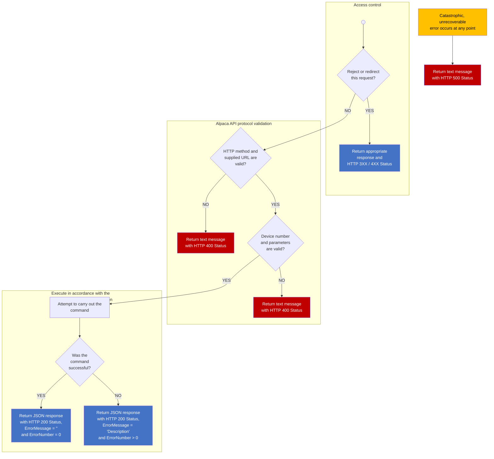
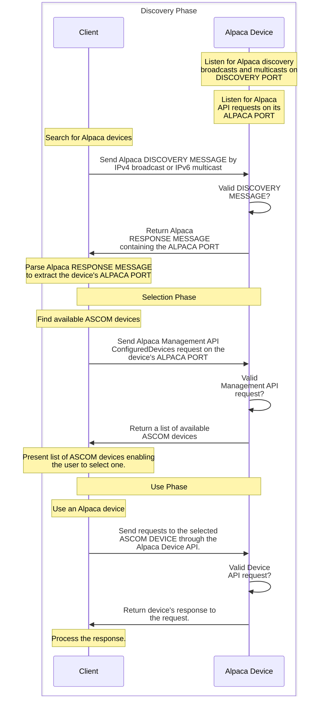
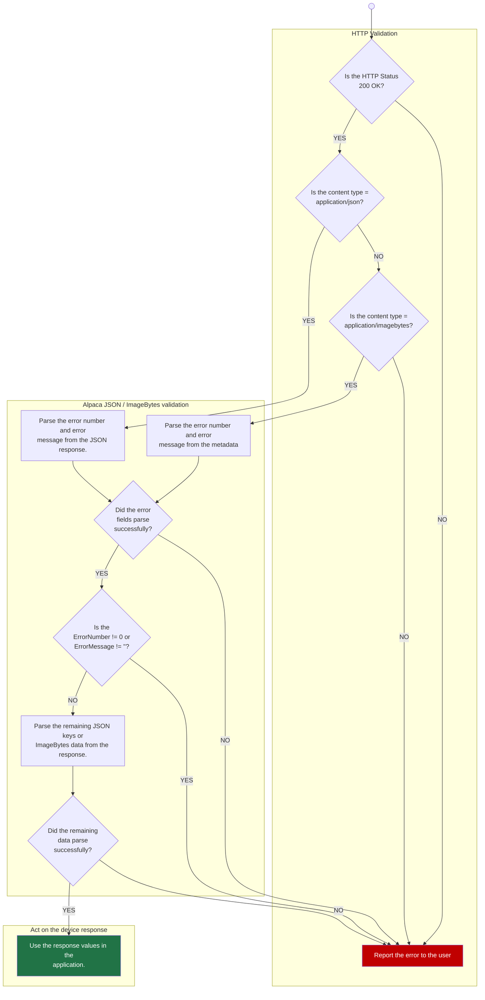

# ASCOM ALPACA API Reference - Version 10

**Authors:** Peter Simpson, Bob Denny, Daniel Van Noord

**Abstract:** This document is the technical reference for the ASCOM Alpaca APIs and describes how to use the API. It also describes the Alpaca Discovery protocol and some of the fundamental behavioural principles that underly the APIs and their effective exploitation.

---

## Table of Contents

1. [Introduction](#1-introduction)
2. [Alpaca Device API Contract](#2-alpaca-device-api-contract)
3. [HTTP Headers](#3-http-headers)
4. [Alpaca Device Management](#4-alpaca-device-management)
5. [Alpaca Discovery](#5-alpaca-discovery)
6. [Alpaca Client Considerations](#6-alpaca-client-considerations)
7. [ASCOM APIs - Essential Concepts](#7-ascom-apis---essential-concepts)
8. [Alpaca Camera ImageBytes Reference](#8-alpaca-camera-imagebytes-reference)
9. [Document Revision Log](#9-document-revision-log)

---

## 1. Introduction

### 1.1 Language

When used within this document, these words have the following meanings:

| Term | Meaning |
|------|---------|
| **Alpaca Device** | Hardware or software that supports the Alpaca Management and Alpaca Device API protocols to provide access to one or more ASCOM Devices. |
| **ASCOM Device** | An implementation of an ASCOM device interface such as ITelescope or IFocuser that can be accessed through the Alpaca Device API protocol. |
| **ASCOM Device Type** | One of ASCOM's supported hardware device types e.g. telescopes, focusers, rotators and cameras. |
| **IP Endpoint** | The host / IP address and port number on which the Alpaca device is operating |
| **Must** | This is an absolute, mandated, requirement; no deviation is possible. |
| **Should** | This is highly recommended best practice, but is not mandated |
| **Could** | This is optional at the implementor's discretion |

### 1.2 Alpaca Devices

An Alpaca Device is a hardware device or software program that presents one or more ASCOM Devices through the Alpaca protocol and communicates with clients over a TCP/IP network through its IP Endpoint.

The simplest Alpaca Device would present a single ASCOM Device, such as a focuser or filter wheel, and would be dedicated to this single task. This approach will work well for existing devices that support serial or USB connections for example and that are to be updated to support network connectivity.

A **complex** Alpaca Device may present multiple¹ ASCOM Devices of several different ASCOM Device Types through its single IP Endpoint. For example, a single Alpaca Device could present a dome, a mount, several focusers, a filter wheel and a rotator together with some observing conditions devices.

> ¹ Each Alpaca device can support up to 2,147,483,647 instances of each of the supported ASCOM Device Types.

In today's ASCOM COM architecture all drivers fit the "simple" model above where one ProgID, the device's well-known address, is associated with just one ASCOM Device.

### 1.3 Consolidation

The Alpaca API supports consolidation of multiple downstream Alpaca Devices into one virtual Alpaca Device that presents a single aggregated device tree under one IP end point. This opens the way to creation of physical devices that proxy Alpaca requests and to the use of web servers as reverse proxies that front multiple Alpaca Devices.

### 1.4 Supported ASCOM Device Types

All ASCOM device types are supported except for Video. This was omitted because the Video interface specifies that recorded video is saved as a file on local storage rather than being streamed over an IP network.

### 1.5 ASCOM Alpaca API Documentation

The ASCOM RESTful APIs are documented using the Swagger toolset and are available through a URL on the ASCOM Standards web site. The ASCOM API is fully documented here:

**https://www.ascom-standards.org/api**

To start exploring, go to the above URL and select either the "Device API" or the "Management API" description using the drop-down at the top of the screen. You can then click a grey Show/Hide link to expand one of the sets of methods and then click the blue GET or orange PUT methods for detailed information on that API call.

Anyone who is familiar with the ASCOM COM based APIs should feel at home with the functionality available through the Alpaca API.

### 1.6 Discovery

For the best astronomer user experience, Alpaca Devices should also implement the Alpaca Discovery protocol (see section 5, Alpaca Discovery)

### 1.7 Robustness Principle (Postel's Law)

> "Be conservative in what you do, be liberal in what you accept from others."

Alpaca clients and devices should behave in line with the robustness principle. For example:

- Alpaca clients should ensure that their commands adhere exactly to the API specification.
- Alpaca devices should ensure that their responses adhere exactly to the API specification.
- Alpaca clients and devices should not return errors when optional elements such as ClientID or ServerTransactionID are not present.
- Alpaca clients and devices should not return errors when unrecognised parameters are received.

---

## 2. Alpaca Device API Contract

This section describes the Alpaca Device API format and assumes a basic knowledge of HTTP, JSON and REST. The full Alpaca Device API is defined here: [Device API Definition](https://www.ascom-standards.org/api).

### 2.1 Alpaca Device API Format

#### 2.1.1 Basic format

Alpaca APIs follow the standard Internet URL format:

```
http(s)://host:port/path?parameters
```

#### 2.1.2 Alpaca API Path

The Alpaca device API path consists of five elements:

```
/api/v{version_number}/{device_type}/{device_number}/{command}
```

| Element Number | Element | Description |
|----------------|---------|-------------|
| 1 | `api` | Fixed lower-case text denoting the root of the API path |
| 2 | `v{version_number}` | Integer API version number prefixed with a lower-case v |
| 3 | `{device_type}` | ASCOM device type e.g. camera, telescope, focuser etc. |
| 4 | `{device_number}` | Integer device number of the required device |
| 5 | `{command}` | Command to be processed by the device in lower-case |

For example, these are valid API calls:

```
http://api.peakobservatory.com/api/v1/telescope/0/atpark
http://api.peakobservatory.com/api/v1/camera/0/imagearray
```

#### 2.1.3 Device number

The device number, starting at 0 for each device type, (in the range 0::4294967295) must be unique within the device type, but the same device number can be used concurrently within multiple device types. E.g. all these paths are permissible within the same Alpaca device:

```
/api/v1/telescope/0/...
/api/v1/rotator/0/...
/api/v1/focuser/0/...
```

#### 2.1.4 Parameters

Many ASCOM methods require parameter values. All methods that use the HTTP GET verb should include parameters as query string name-value pairs.

All methods that use the HTTP PUT verb should include name-value parameters in the body using the `application/x-www-form-urlencoded` media type.

For example, these are valid API parameters on an HTTP GET transaction:

```
/api/v1/telescope/0/canslew?clientid=231&clienttransactionid=23
```

### 2.2 Case Sensitivity

#### 2.2.1 URL Path Elements

All five elements of the API path are case sensitive and must always be in lower case. For example, this is the only valid casing for a call to the Telescope.CanSlew property:

```
/api/v1/telescope/0/canslew
```

These are examples of **incorrect** casing:

```
/API/V1/TELESCOPE/0/CANSLEW
/Api/V1/Telescope/0/CanSlew
/api/v1/telescopE/0/canslew
/api/v1/telescope/0/CanSlew
```

#### 2.2.2 Query Parameters (HTTP GET methods)

Alpaca parameters are key-value pairs where:

- The parameter key is case insensitive
- Boolean parameter values should be sent as: `true` or `false` and can use any casing.
- String parameter values that are defined in an ASCOM Interface, such as the SensorName parameter in `IObservingConditions.SensorDescription(string SensorName)`, must be cased in accordance with any requirements stated in the Interface specification.

For example, these are all valid API parameters:

```
/api/v1/telescope/0/canslew?clientid=231&clienttransactionid=23
/api/v1/telescope/0/canslew?ClientID=231&ClientTransactionID=23
/api/v1/telescope/0/canslew?CLIENTID=231&CLIENTTRANSACTIONID=23
```

Clients and drivers must expect incoming query parameter keys to have arbitrary casing.

#### 2.2.3 Form Parameters (HTTP PUT Methods)

Clients must case Form parameter names as specified in the online API Definition. For example, correct parameter name casing for the X binning parameter in the PUT Camera.BinX method is:

```
BinX
```

These are examples of **incorrect** casing:

```
binx
BINX
binX
```

#### 2.2.4 REST Response Key Names

JSON key names are case sensitive. Consequently, returned Alpaca parameter names must use the casing specified in the online API definition. For example: the GET Telescope.Altitude response **must** use this key name casing:

```
Value, ClientTransactionID, ServerTransactionID, ErrorNumber, ErrorMessage
```

These are examples of **incorrect** casing:

```
value, clientTransactionID, serverTransactionID, errorNumber, errorMessage
value, clienttransactionid, servertransactionid, errornumber, errormessage
```

### 2.3 Locale and Culture

The Alpaca API is culture neutral in order to facilitate use between clients and devices running in different locales, e.g. a client on a UK device connecting to a device running with a Spanish locale.

This has consequences for data formats in two circumstances:

#### 2.3.1 Encoding Numeric Parameter Values

Thousands separators must not be used and decimal parameter values must use period (0x2E) as the decimal separator so that they can be reliably parsed on receipt.

E.g. `23.456` is a valid value to supply when setting the `Telescope.TargetRightAscension` property, while `23,456` is not a valid value. `123456` is a valid ClientID while `123,456` is not.

#### 2.3.2 JSON Responses

JSON responses must be formatted in accordance with the JavaScript Object Notation (JSON) Data Interchange Format specification RFC 8259. In consequence Alpaca devices must use the period character (0x2E) as the decimal separator when returning decimal values.

Alpaca Clients must expect to receive decimal values in this invariant culture format and to interpret them accordingly.

E.g. Clients must parse the value returned by the `Telescope.SiteElevation` property using period as the decimal separator, regardless of the locale in which they are running.

### 2.4 Http Verbs

| Verb | Description |
|------|-------------|
| **GET** | Used for all information retrieval where the device state is not changed, e.g. most properties and a few functions such as `Telescope.AxisRates(Axis)`. |
| **PUT** | Used for all commands which change the state of the device, e.g. `Telescope.SideOfPier` and `Telescope.SlewToCoordinates()`. |

### 2.5 HTTP Status Codes

The purpose of ASCOM interfaces is to hide real world device implementation behind a standard facade represented by an ASCOM interface. In the business world IT developers would consider the interfaces to be part of the enterprise's "business logic". ASCOM's "business logic" defines a clear interface contact between client and device that includes its own "do it or return an error" error handling mechanic, which takes the form of an error number / error message pair.

Alpaca is essentially a presentation layer for the ASCOM interface "business logic" and this distinction between transport mechanic behaviour and ASCOM interface business logic behaviour is reflected in Alpaca's use of HTTP status codes.

HTTP 3XX and 4XX status codes reflect issues in the HTTP and Alpaca protocols, such as lack of authentication, badly formed or missing parameters. These HTTP statuses indicate that the device:

- Refused to carry out the command for some reason e.g. could not authenticate the user
- Did not understand the operation it was being asked to perform
- Did not receive the required information to attempt to carry out the intended ASCOM interface operation.

A 200 status indicates that the "business logic" ASCOM interface command was understood, and that the device attempted to carry it out using ASCOM's "Do it or return an error" mechanic. The resultant JSON response includes an ErrorNumber value that the client can inspect to determine whether the operation was successful in an ASCOM interface sense.

These status codes should be used in device responses to Alpaca clients:

| Code | Interpretation | Extended Interpretation |
|------|----------------|------------------------|
| **200** | ASCOM interface operation was executed | The API request was understood and the "Do it or return an error" ASCOM interface method was executed. The response is in the JSON format as defined in the Alpaca API specification. |
| **400** | ASCOM interface operation was not executed | The API request could not be understood or was rejected. The response is a text error message and is not in the expected JSON format. |
| **500** | Unexpected device error | A serious technical error occurred in the Alpaca device which prevented successful processing of the request. The response is a text error message and is not in the expected JSON format. |

The following flow diagram shows how to decide which HTTP status code to return:



*Figure 1 - Alpaca HTTP status decision tree*

Please note that, catastrophic errors aside, an HTTP 200 status must be returned when the device understands the supplied command regardless of whether or not it can action it in an ASCOM sense.

#### 2.5.1 Status Code Examples - Transactions with Valid Paths

A "200" status code must be returned if the transactions below were received by an Alpaca Telescope device that supports Alpaca interface version 1:

| Path | Reason for Rejection with 200 Status |
|------|-------------------------------------|
| `PUT /api/v1/telescope/0/park` | Assuming this telescope device does not have park functionality, it would return a NotImplemented Alpaca error code (0x400) and message with an HTTP 200 status. |
| `PUT /api/v1/telescope/0/siteelevation` (New value: -400) | Elevations lower than -300m are invalid so return an InvalidValue Alpaca error code (0x401) and message with an HTTP 200 status. |

#### 2.5.2 Status Code Examples - Transactions with Bad Paths

A "400" status code must be returned if the transactions below were received by a single Alpaca Camera device that only supports Alpaca interface version 1:

| Path | Reason for Rejection with 400 Status |
|------|-------------------------------------|
| `GET: /apii/v1/telescope/0/canslew` | Valid Alpaca API requests start with "api" rather than "apii". |
| `GET: /api/v2/telescope/0/canslew` | The Alpaca "v2" API is not supported by the device. |
| `GET: /api/v1/telescop/0/canslew` | "telescop" is not one of the valid ASCOM device types. |
| `GET: /api/v1/camera/1/canslew` | Camera device 1 does not exist. |
| `GET: /api/v1/camera/0/canslew` | "CanSlew" is not a valid Camera command. |

### 2.6 ID Fields

To aid operational management and debugging, three ID fields are defined for use in read and write transactions:

| ID | Maintained by | Description |
|----|---------------|-------------|
| **ClientID** | Client | This is a 32-bit unsigned integer that the client can choose to identify itself. It is recommended that values should be within the range 0::65535 so that log files appear orderly and readable! |
| **ClientTransactionID** | Client | This is a 32-bit unsigned integer that the client maintains. The value should start at 1 and be incremented by the client on each request to the Alpaca device. |
| **ServerTransactionID** | Alpaca Device | This is a 32-bit unsigned integer that the Alpaca device maintains. The value should start at 1 and be incremented by the Alpaca device on each request. |

The client id and transaction numbers should be supplied by the client in the request to uniquely identify the client instance and specific transaction. The Alpaca device must return the client transaction number, or zero if no value was supplied by the client, as part of its response to enable the client to confirm that the response does relate to the request it submitted.

Alpaca devices should record client ids and transaction numbers in their logs so that issues can be tied back to specific transactions and outcomes correlated with client-side logs.

The server transaction id must be returned by the Alpaca device with every response so that issues identified on the client side can easily be correlated with Alpaca device logs.

### 2.7 JSON Responses

The outcome of the command is returned in JSON encoded form. The following information **must** always be returned in every transaction response that has an HTTP 200 status:

| Item | Type | Contents |
|------|------|----------|
| **ClientTransactionID** | Unsigned 32-bit integer | Transaction ID supplied by the client in its request |
| **ServerTransactionID** | Unsigned 32-bit integer | The server's transaction number. |
| **ErrorNumber** | Signed 32-bit integer | ASCOM Alpaca error number, see section 2.8.3. |
| **ErrorMessage** | String | If the driver throws an exception, its message appears here, otherwise an empty string is returned. |

In addition, the JSON response will include the output from the command (if any) in the "Value" parameter. This example is from the Telescope Simulator SupportedActions property:

```
GET /api/v1/telescope/0/supportedactions?ClientID=1&ClientTransactionID=6
```

```json
{
  "Value": ["AssemblyVersionNumber", "SlewToHA", "AvailableTimeInThisPointingState", "TimeUntilPointingStateCanChange"],
  "ClientTransactionID": 6,
  "ServerTransactionID": 6,
  "ErrorNumber": 0,
  "ErrorMessage": ""
}
```

This example shows the response from the Telescope simulator's CanSlewAsync property:

```
GET /api/v1/telescope/0/canslewasync?ClientID=1&ClientTransactionID=20
```

```json
{
  "Value": true,
  "ClientTransactionID": 20,
  "ServerTransactionID": 168,
  "ErrorNumber": 0,
  "ErrorMessage": ""
}
```

Alpaca devices must set a Content-Type header indicating that JSON content is being returned e.g.:

- `Content-Type: application/json`
- `Content-Type: application/json; charset=utf-8`

### 2.8 Reporting Device Errors Through the Alpaca API

#### 2.8.1 Historic COM Approach

ASCOM COM drivers use a range of reserved ASCOM exceptions and unique driver specific exceptions to report issues to COM clients such as "this method is not implemented" or "the supplied parameter is invalid" and these are documented in the Developer Help file at:

**https://ascom-standards.org/Help/Developer/html/N_ASCOM.htm**

Each exception has an associated HResult code in the range 0x80040400 to 0x80040FFF for historic reasons related to Microsoft's approach to error handling for COM applications. When expressed as signed integers these exception numbers translate into very large and unwieldy negative numbers e.g. 0x80040400 becomes -2,147,220,480 and 0x80040FFF becomes -2,147,217,409.

#### 2.8.2 New Alpaca Approach

Alpaca devices still need to express different error conditions to the client so, for Alpaca, the error number range has been simplified to the range 0x400 (1024) to 0xFFF (4095) by truncating the leftmost 5 digits so that an Alpaca error number of 0x401 would have the same meaning as the original COM error with HResult of 0x80040401.

#### 2.8.3 ASCOM Reserved Error Numbers

The following table relates the new Alpaca error codes for reserved ASCOM error conditions to the corresponding COM HResult numbers, which are in the range 0x80040400 to 0x800404FF.

| Condition | Alpaca Error Number | COM Exception Number |
|-----------|--------------------|--------------------|
| Successful transaction | 0x0 (0) | N/A |
| Property or method not implemented | 0x400 (1024) | 0x80040400 |
| Invalid value | 0x401 (1025) | 0x80040401 |
| Value not set | 0x402 (1026) | 0x80040402 |
| Not connected | 0x407 (1031) | 0x80040407 |
| Invalid while parked | 0x408 (1032) | 0x80040408 |
| Invalid while slaved | 0x409 (1033) | 0x80040409 |
| Invalid operation | 0x40B (1035) | 0x8004040B |
| Action not implemented | 0x40C (1036) | 0x8004040C |

#### 2.8.4 Driver Specific Error Numbers

The Alpaca error number range for driver specific errors is 0x500 to 0xFFF and their use and meanings are at the discretion of driver / firmware authors.

#### 2.8.5 Error Number Backwards Compatibility

Native Alpaca clients will inspect the ErrorNumber and ErrorMessage fields as returned to determine if something went wrong with the transaction. However, to ensure COM client backward compatibility, the Platform's Dynamic clients will translate Alpaca error numbers into their equivalent COM exception numbers before throwing the expected ASCOM exceptions to the COM client.

#### 2.8.6 Driver Error Example

The following example shows the expected invalid value JSON response when an attempt is made to set the site elevation to -400, which is below the minimum allowed value of -300.

```
PUT /api/v1/telescope/0/siteelevation
```

(parameters for the PUT verb are placed in the form body (not shown here) and do not appear after the URI as they do for the GET verb)

Expected JSON response:

```json
{
  "ClientTransactionID": 23,
  "ServerTransactionID": 55,
  "ErrorNumber": 1025,
  "ErrorMessage": "SiteElevation set - '-400' is an invalid value. The valid range is: -300 to 10000."
}
```

### 2.9 Alpaca API Version versus ASCOM Device InterfaceVersion

The scope of the Alpaca API version number is just the new Alpaca API presentation elements and their order as described in sections 2.1 and 4.1.2. Any change to the naming, format or order of the elements in these URLs would constitute a breaking change and require that the Alpaca API version be incremented so that clients and devices can adapt their behaviour to match the new standard.

For backward compatibility, a device can support more than one interface version. A list of supported interface versions is available through the Alpaca management API as described in section 4.2.1.

**Examples of breaking changes that would require a new Alpaca API version number:**

- Changing element 1 from "api" to "alpacaApi"
- Changing the element 2 version number format from "v1" to "v1.0.0.0"
- Introducing a new element 6

The ASCOM Device InterfaceVersion defines the behaviour of the specified ASCOM Device when presented with commands through the Alpaca API. InterfaceVersions will change as device APIs are developed, however these changes are independent of the Alpaca API presentation elements and so do not require that the Alpaca API version be changed as well.

---

## 3. HTTP Headers

Alpaca primarily uses HTTP headers to show willingness to use specific Alpaca features such as ImageBytes.

### 3.1 Clients

#### 3.1.1 Mandatory Headers

- Camera clients **must** include the `Accept: application/imagebytes` header when they wish to use the Alpaca Camera ImageBytes Reference; it is not required in any other circumstance.

#### 3.1.2 Good-practice Optional Headers

The following headers can be added at the client author's discretion:

- `Accept: application/json`
- `User-Agent: Your user agent description string`

### 3.2 Devices

#### 3.2.1 Mandatory Headers

- Camera devices that support the Alpaca Camera ImageBytes Reference **must** include the `Content-type: application/imagebytes` header when returning data using the ImageBytes protocol; it is not required in any other circumstance.

#### 3.2.2 Good-practice Optional Headers

The following headers can be added at the device author's discretion:

- `Content-type: application/json`
- `Server: Your server description string`

---

## 4. Alpaca Device Management

This section describes the HTTP and REST management APIs for Alpaca devices.

### 4.1 HTML Interfaces

The Alpaca Management API defines a main HTML browser URL that acts as the primary user entry point for the whole Alpaca device. The returned web page must, at minimum, display overall information about the device and its manufacturer.

In addition, the API defines a dedicated URL for each ASCOM Device presented by the Alpaca Device so that ASCOM Device specific configuration can be set. This API is intended to facilitate configuration of a single ASCOM Device, in a similar fashion to the COM SetupDialog method.

#### 4.1.1 Main Alpaca Setup URL

The main Alpaca Device setup HTTP page should be provided on the "setup" path of the device's Alpaca Port:

```
http(s)://host:port/setup
```

At minimum this must provide manufacturer and device descriptive information. This could be a good place to enable the astronomer user to change the Alpaca discovery port number and any other "whole device" configuration settings.

#### 4.1.2 ASCOM Device Specific Setup URLs

These follow a similar format to the Alpaca Device API with an overall format of:

```
http(s)://host:port/path
```

The Alpaca device API path consists of five elements:

```
/setup/v{version_number}/{device_type}/{device_number}/setup
```

| Element Number | Element | Description |
|----------------|---------|-------------|
| 1 | `setup` | Fixed lower-case text denoting the root of the API path |
| 2 | `v{version_number}` | Integer API version number prefixed with a lower-case v |
| 3 | `{device_type}` | ASCOM device type e.g. camera, telescope, focuser etc. |
| 4 | `{device_number}` | Integer device number of the required device |
| 5 | `setup` | Fixed lower case text denoting the device setup page |

For example, this is a device specific setup URL for telescope 0:

```
http://api.peakobservatory.com/setup/v1/telescope/0/setup
```

### 4.2 JSON Management API

The Alpaca management API is described here: [Alpaca Management API](https://www.ascom-standards.org/api).

#### 4.2.1 Supported API Versions

The Alpaca device API uses an interface version number (see section 2.9) to manage changes to the Alpaca access elements that are described in section 2.1. The format of the apiversions URL is:

```
http(s)://host:port/management/apiversions
```

For example, this is an api version URL:

```
http://api.peakobservatory.com/management/apiversions
```

Please note that there is **no** Alpaca API version number in the apiversions URL.

This is by design so that this URL will work regardless of any Alpaca interface version number changes in the future.

To provide backward compatibility, an Alpaca device can simultaneously support more than one Alpaca interface version, and this is indicated by returning more than one integer version number in the apiversions array.

At the time of writing only interface version 1 is defined and consequently all Alpaca devices should return an integer array, containing the single value 1, as the response to this command.

#### 4.2.2 Description and Configured Devices

The "description" endpoint should return cross cutting information about the Alpaca Device as a whole, such as its name and location.

The "configureddevices" endpoint should return an array of device configuration objects that describe the ASCOM Device's that are presented by the Alpaca Device. Each device description must include the device's name, it's ASCOM device type, the device number that must be used to communicate with this particular ASCOM Device and a globally unique id for this particular device.

The Alpaca management API path for these commands consists of three elements:

```
/management/v{version_number}/{command}
```

| Element Number | Element | Description |
|----------------|---------|-------------|
| 1 | `management` | Fixed lower-case text denoting the root of the API path |
| 2 | `v{version_number}` | Integer API version number prefixed with a lower-case v |
| 3 | `{command}` | Either "description" or "configureddevices" as required |

For example, these are valid calls:

```
http://api.peakobservatory.com/management/v1/description
http://api.peakobservatory.com/management/v1/configureddevices
```

#### 4.2.3 Globally Unique IDs (UIDs)

These are string identifiers that must be globally unique. This means that identical hardware devices must have unique individual UID's that are never assigned to other devices of the same type and are never assigned to devices of any other type.

The purpose of UIDs is to support "re-discovery" of Alpaca Devices in the event that a device's IP address changes but where client configurations are not automatically revised to match. For further information please see section 5.7.

---

## 5. Alpaca Discovery

### 5.1 Introduction

Clients can discover Windows COM based drivers through ASCOM's registry-based Chooser capability. However, Alpaca devices can run on any operating system and may be located on different devices than client applications. Consequently, Alpaca clients need a discovery mechanism that enables them to locate Alpaca devices within their local network environment.

### 5.2 Definitions

Within this section "Device" refers to something (a driver or device) that exposes the Alpaca interface and "Client" refers to client applications that want to locate and use the Device's API(s).

| Term | Definition |
|------|------------|
| **DISCOVERY PORT** | The port to which the Client Broadcasts the discovery message and on which the Device listens. The Alpaca default discovery port is **32227**. |
| **DISCOVERY MESSAGE** | The message broadcast by the client on the DISCOVERY PORT. |
| **RESPONSE MESSAGE** | The message that the Device sends back via unicast to the client. |
| **ALPACA PORT** | The port on which the Alpaca management and device APIs are available. |
| **ASCOM DEVICE** | An implementation of an ASCOM device interface such as ITelescope or IFocuser that can be accessed through the Alpaca Device API protocol. |
| **UNIQUE ID** | A string identifier for an ASCOM DEVICE that is globally unique. |
| **ALPACA DEVICE** | Hardware or software that supports the Alpaca Management and Alpaca Device API protocols to provide access to one or more ASCOM DEVICES. |

The following diagram illustrates the discovery protocol flow:



*Figure 2 - Alpaca IPv4 and IPv6 discovery protocol*

### 5.3 Alpaca Discovery Protocol - IPv4

#### 5.3.1 Clients

Clients find devices through a UDP protocol that uses:

- the IPv4 network broadcast address
- a designated IP port number, whose default is 32227
- a structured DISCOVERY MESSAGE
- a structured RESPONSE MESSAGE

To search for and use ALPACA DEVICES, a client should:

1. Transmit a DISCOVERY MESSAGE to the DISCOVERY PORT by broadcast (IPv4).
2. Use the IP address from the RESPONSE MESSAGE together with the ALPACA PORT from the DISCOVERY RESPONSE to query the Alpaca Management API to determine which ASCOM DEVICES and device types are available.
3. When selected by the user, access specific devices through the ALPACA DEVICE API that also runs on the ALPACA PORT at the IP address of the initiator of the RESPONSE MESSAGE.

#### 5.3.2 Devices

To listen for IPv4 DISCOVERY MESSAGEs, Alpaca devices should:

1. Listen for IPv4 broadcasts on the DISCOVERY PORT
2. Assess each received message to confirm whether it is a valid DISCOVERY MESSAGE.
3. If the request is valid, return a RESPONSE MESSAGE indicating the device's ALPACA PORT.

### 5.4 Alpaca Discovery Protocol - IPv6

#### 5.4.1 Clients

Clients find devices through a UDP protocol that uses:

- the fixed IPv6 link local multicast address: `ff12::a1:9aca`
- a designated IP port number, whose default is 32227
- a structured DISCOVERY MESSAGE
- a structured RESPONSE MESSAGE

To search for and use ALPACA DEVICES, a client should:

1. Transmit a DISCOVERY MESSAGE to the DISCOVERY PORT using IPv6 multicast address `ff12::a1:9aca`.
2. Use the IP address from the RESPONSE MESSAGE together with the ALPACA PORT from the DISCOVERY RESPONSE to query the Alpaca Management API to determine which ASCOM DEVICES and device types are available.
3. When selected by the user, access specific devices through the ALPACA DEVICE API that also runs on the ALPACA PORT at the IP address of the initiator of the RESPONSE MESSAGE.

#### 5.4.2 Devices

To listen for DISCOVERY MESSAGEs, Alpaca devices should:

1. Join the Alpaca IPv6 multicast group on address `ff12::a1:9aca`.
2. Listen for Alpaca IPv6 multicasts on the DISCOVERY PORT
3. Assess each received message to confirm whether it is a valid DISCOVERY MESSAGE.
4. If the request is valid, return a RESPONSE MESSAGE indicating the device's ALPACA PORT.

### 5.5 Discovery Message Format

To provide for future extension, if required, the DISCOVERY MESSAGE has a structured format:

| Byte Number | Content |
|-------------|---------|
| 0::14 | Fixed ASCII text: `alpacadiscovery` |
| 15 | ASCII Version number: `1` for the current version. The version number sequence is 1::9 then A::Z. |
| 16::63 | ASCOM reserved for future expansion |

The current, version 1, discovery message therefore contains 16 bytes, comprising 15 bytes from the ASCII text: "alpacadiscovery" together with a single ASCII version byte:

```
alpacadiscovery1
```

Hex: `0x61, 0x6C, 0x70, 0x61, 0x63, 0x61, 0x64, 0x69, 0x73, 0x63, 0x6F, 0x76, 0x65, 0x72, 0x79, 0x31`

The discovery message "alpacadiscovery" has been registered to ASCOM in the IANA service registry:

**https://www.iana.org/assignments/service-names-port-numbers**

### 5.6 Discovery Response Format

The ALPACA DEVICE response must be a JSON object containing the device's ALPACA PORT e.g.:

```json
{
  "AlpacaPort": 12345
}
```

### 5.7 Unique IDs (UID)

An ASCOM DEVICE's UID is returned within the Alpaca Management API ConfiguredDevices response.

The UID is an ASCII string that **MUST** be unique to each ASCOM DEVICE. Its purpose is to help clients re-discover a previously used ASCOM DEVICE if its IP address changes.

1. The UID must be derived from a 48bit or larger space and converted to an ASCII string.
2. The UID must be exposed through the UniqueID field of the Alpaca Management API ConfiguredDevices response.
3. Manufacturers and developers must use appropriate algorithms to ensure that otherwise identical devices have different UIDs.
4. Alpaca Devices **MUST** send the same UIDs on every network interface to which the device is attached.
5. Once a UID has been assigned to an ASCOM DEVICE, it must never change. This means that:
   - An ASCOM DEVICE served by an ALPACA DEVICE will always be uniquely identifiable through the assigned UID.
   - UID must be retained when devices are powered down.

### 5.8 Implementation Requirements

#### 5.8.1 Discovery Port

The Alpaca DISCOVERY PORT number must default to **32227** and should not require adjustment in most implementation scenarios. However, the DISCOVER PORT must be configurable by the astronomer user to support scenarios such as:

- the default DISCOVERY PORT is in use by another application.
- the network configuration requires multiple independent Alpaca discovery domains.

#### 5.8.2 IP versions

All Alpaca devices should support IPv4 to ensure widest adoption and best compatibility with client devices and astronomy equipment. Devices could also support IPv6 at the discretion of the manufacturer / software author.

---

## 6. Alpaca Client Considerations

### 6.1 Error Handling

As with all API consuming applications Alpaca clients are best coded defensively so that they can handle incorrect or malformed JSON that may be returned by devices.

In an exception driven interface the exception mechanic forces the application to handle the exception when the device indicates that something went wrong. Applications don't have a choice at that point, the exception just hits them, they catch it and respond to it, regardless of what they would otherwise have done with the device response.

In the Alpaca interface there is no mechanic that "forces" the client to deal with the error immediately, so we recommend that Alpaca clients check the error fields in a JSON response immediately on receipt, and before trying to process the returned value.

When the device returns an error response, parsing the full JSON response directly to the expected data class can expose you to unexpected issues such as the Value key having unexpected contents. For example, the content of the Value key could be "null" even though the expected data type is a non-nullable basic type such as int, double or bool.

The Alpaca Clients in the ASCOM Library use the following algorithm to ensure the most reliable operation. If you "roll your own" clients, we recommend that you adopt a similar approach:

**Client Error Handling Flow:**

1. **HTTP Validation**
   - Is the HTTP Status 200 OK?
     - NO → Report the error to the user
     - YES → Continue to content type check

2. **Content Type Check**
   - Is the content type = `application/json`?
     - YES → Parse error number and error message from JSON response
   - Is the content type = `application/imagebytes`?
     - YES → Parse error number and error message from metadata
   - Neither → Report the error to the user

3. **Error Field Validation**
   - Did the error fields parse successfully?
     - NO → Report the error to the user
     - YES → Check if ErrorNumber != 0 or ErrorMessage != ""
       - YES → Report the error to the user
       - NO → Parse remaining JSON keys or ImageBytes data

4. **Data Validation**
   - Did the remaining data parse successfully?
     - NO → Report the error to the user
     - YES → Use the response values in the application

The following diagram illustrates this error handling flow:



*Figure 3 - Client Error Handling*

---

## 7. ASCOM APIs - Essential Concepts

### 7.1.1 Object Models - Properties and Methods

The ASCOM APIs are built on an object model which provides properties that represent some state of the device, and methods that can change the state of the device. For example, the current positional right ascension of a telescope mount is a property, and a command to slew the mount to a different position is a method. In ASCOM COM, properties are normally accessed by assignment statements in the native syntax of any of twenty languages on Windows. Methods are represented by native syntax function calls, some with parameters. There are exceptions. Some properties require parameters to signify some aspect of state, and thus may be represented by a function call which returns the property value (which need not be a scalar), for example, `Telescope.AxisRates(Axis)`.

### 7.1.2 ASCOM API Characteristics

The following information applies to the existing COM-based ASCOM APIs as well as the REST-based APIs. The behaviours must be the same to provide transparent interoperation.

**Routine Operations:** Interface design always involves some negotiations between the parties. Inevitably, a device maker may wish to have included in the interface some clever means to make their device stand out above those of his competitors. On the other hand, client programmers don't want to be writing code to manage an ever-expanding set of these clever functions. It defeats the purpose of the standardized API. The ASCOM API was therefore designed at its outset to cover routine operations only.

For example, a mount really only needs "point to these coordinates" and "track the apparent motion of my object". The more accurately it does these things, the better. As a client program developer, I don't want to be concerned about PEC or encoder resolutions or servo currents.

**Synchronous vs Asynchronous Methods:** One may think of a method call as one that returns only when the requested operation has completed, which is a synchronous call. But some types of operations can benefit by starting the operation and returning immediately. For example, the `Rotator.Move()` method may return immediately.

If so, its return means only that the rotation was successfully started. Rotators are typically slow, and the system can benefit by overlapping mount and rotator movement, so both provide asynchronous calls. The status properties such as `Rotator.IsMoving` and `Telescope.IsSlewing` are used to monitor progress of asynchronous calls.

**"Can" Properties:** Some ASCOM APIs have "can" properties, which tell the client whether or not a corresponding capability is available. For example, in the Telescope API, the `CanSlewAltAz` property tells the client whether this specific mount can successfully execute the `SlewToAltAz()` method. These "can" properties exist only for methods which can't be directly tested without changing the state of the device.

For example, a client can tell that the mount provides its positional azimuth by trying to read the `Azimuth` property; it will either get an answer or a "not implemented" error. However, a client cannot tell whether a mount can slew to alt/az coordinates without calling the method and possibly changing the mount's position. This is why a `CanSlewAltAz` property is provided for the `SlewToAltAz()` method.

### 7.1.3 Behavioural Rules

Heterogeneous distributed systems require both common standardized APIs and a set of behavioural rules that must be obeyed by all modules in the system. The implementation of a module is where these rules are effected, they do not appear in the abstract API definitions themselves. These behavioural rules are already implemented by ASCOM COM drivers.

**ASCOM's modular rules are:**

- **Do it right or report an error:** Fetching or changing a property, or calling a method, must always result in one of two outcomes: The request must complete successfully, or an error must be signalled, preferably with some (human readable) indication of why the request could not be satisfied. An example of violating this rule would be a method call to move a rotator to a given mechanical angle, but the rotator ends up at some other angle and no error is reported to the caller.

- **Retries prohibited:** No module must ever depend on another to provide timeouts or retry logic. If a device needs check-and-retry logic in its routine operation, that logic must be contained within the module itself. If there's a problem and your module's own retry logic can't resolve the issue report the error as required above.

- **Independence of operations:** To the extent possible with the device, each API operation should be independent of the others. For example, don't impose a specific call order such as needing to fetch the positional right ascension of a mount immediately before fetching the declination.

- **Timing Independence:** To the extent possible with the device, modules must not place timing constraints on properties and methods. Implement asynchronous calls wherever possible in order not to lock up clients unnecessarily.

- **Self-Protection – Over Use:** Drivers must protect themselves and the instrument from excessive rates of incoming requests from clients. Of course, clients should minimize the need for calling across the internet to avoid flooding, but responsibility for protecting a device from excessive request rates rests with the device and its driver.

- **Self-Protection – Illegal/hazardous operations:** Drivers and instruments should protect themselves from illegal or hazardous operations. E.g. a dome may be opening but receives a request to close the shutter. If the shutter can be safely reversed while opening, the driver could simply close the shutter and report success. Alternatively, the driver may permit the shutter to fully open and return an illegal operation error response to the close command.

- **No Status Inconsistencies:** In the example above, the driver ShutterStatus property must accurately reflect the physical shutter condition at all times. If it reports ShutterOpen, even for an instant, before the shutter starts to open, the client will assume that the shutter is properly open and move on to its next task, even though the shutter is still opening.

---

## 8. Alpaca Camera ImageBytes Reference

### 8.1 Context

Shortly after introducing Alpaca, it became clear that the Camera.ImageArray JSON mechanic was very slow when transferring large images. This is because conversion of large image datasets to JSON is computationally expensive and results in substantial network traffic.

Following discussion on the ASCOM Developer Forum, the Base64Handoff (ASCOM Remote Description) mechanic was developed, which converts the camera's image array to a byte array and then encodes the byte values using base64 for transfer over the network connection.

The Base64Handoff mechanic provides a substantial performance improvement over JSON, but use has exposed a number of opportunities for improvement:

- Clients must set a proprietary HTTP header to indicate that they implement the handoff mechanic and inspect response headers for the presence of the proprietary header to confirm that the Alpaca device supports the mechanic. Setting and inspecting proprietary headers is not always straightforward for Alpaca clients and devices.
- The handoff mechanic is a two-step process, requiring two network round trips to retrieve every image:
  1. To retrieve the metadata describing the array.
  2. To retrieve the base64 encoded array data.
- While efficient, the base64 algorithms still add a processing overhead to encode the image data on the Alpaca device and to decode it on the client.
- The base64 encoded image data is about 33% larger than the original data, extending retrieval times and consuming greater network bandwidth than an optimal solution.
- Image data is transferred over the network as 32bit values in accordance with the Camera interface specification, although most image data does not exceed a 16bit dynamic range. An opportunity to halve the amount of data being transferred is not taken.

The new ImageBytes mechanic mitigates the issues above.

### 8.2 ImageBytes Mechanic

ImageBytes is an Alpaca specific, single step mechanic that transfers image data as a structured binary byte stream and uses standard HTTP headers for discovery and control. This mechanic:

- Is effected directly through the Camera.ImageArray and Camera.ImageArrayVariant Alpaca endpoints and consequently does not require additional REST endpoints.
- Sends image data in binary form rather than base64encoded form avoiding the base64 encode and decode overheads as well as reducing network traffic
- Provides for data of byte and Int16/UInt16 size to be transmitted as one / two-byte values rather than as four-byte Int32 values.
- Sends array metadata together with array data in a single structured byte stream.
- Orders array metadata before array data so that the image array data structure can be created before reading the array data.
- Is Alpaca specific and does not change the ASCOM Camera interface definition.

### 8.3 ImageBytes Benefits

Compared to the JSON and Base64Handoff mechanics, the ImageBytes mechanic simplifies implementation, reduces Alpaca device processor requirements and improves image download times by:

- Making use of standard HTTP Accept and Content-Type headers, avoiding the need to create and inspect proprietary headers.
- Eliminating a network round trip to the device by employing a single step that returns both array metadata and image data in a single response.
- Transferring binary data rather than base64 encoded data, which:
  - Reduces network traffic by about 33%
  - Eliminates the base64 encoding overhead on Alpaca devices and the base64 decoding overhead on Alpaca clients.
- Transferring 8bit and 16bit image data over the network as 8 bit / 16bit values rather than as 32bit values, which:
  - Reduces network traffic by a further 50% to 75%, at the expense of some additional processing at the client to change the received data back to the Int32 form required by the interface specification.
  - Improves response times for the user.

In addition:

- There is no impact on the Camera interface definition or version number because there are no new interface members.
- The new mechanic is backward compatible with both the JSON and Base64Handoff mechanics.
- Current Alpaca and COM clients are not impacted in any way.
- COM clients can take advantage of the new mechanic by using the Platform's revised Alpaca Dynamic Camera clients.

### 8.4 Performance Benefits

Performance benefits depend on device capabilities, network speed and topology. As a benchmark, these timings were obtained over a 650Mbit/sec 802.11ac wireless link by a Windows laptop client when accessing a Camera Simulator hosted by an ASCOM Remote Server running on a desktop PC.

**Image Data:** 6000 x 4000 monochrome image² totalling 24 million elements.

| Data Value Range | JSON³ | Base64Handoff⁴ | ImageBytes⁵ |
|------------------|-------|----------------|-------------|
| Int32 | 25.6 | 3.4 | 2.3 |
| Int16 | 16.3 | 3.3 | 1.0 |
| UInt16 | 15.1 | 3.3 | 1.1 |
| Byte | 12.6 | 3.5 | 0.7 |

**Image Data:** 6000 x 4000 x 3 plane colour RGB image² totalling 72 million elements.

| Data Value Range | JSON³ | Base64Handoff⁴ | ImageBytes⁵ |
|------------------|-------|----------------|-------------|
| Int32 | 95.2 | 10.2 | 6.4 |
| Int16 | 64.9 | 9.9 | 3.5 |
| UInt16 | 56.9 | 9.6 | 3.5 |
| Byte | 47.4 | 10.1 | 1.9 |

> ² Array data were random values within the minimum and maximum values of the data type.
> ³ JSON timings are influenced by the average number of text digits (including the negative sign) across the data range.
> ⁴ Base64Handoff timings are not influenced by data value range because elements are always transferred as four-byte Int32 values.
> ⁵ ImageBytes timings are influenced by the number of bytes required to hold the data type

### 8.5 ImageBytes Implementation

To retrieve the camera's image data the client makes an Alpaca call to the Camera.ImageArray property as described in the Alpaca specification.

#### 8.5.1 Client Initiation

If a client supports the ImageBytes protocol, it indicates this to the Alpaca device by including the `application/imagebytes` mime type in the HTTP "Accept" header that it sends to the Alpaca device's ImageArray endpoint.

#### 8.5.2 Device Response

If the Alpaca device doesn't support the ImageBytes mechanic, it will return the image data as a JSON string and indicate this by setting the "Content-Type" header in its response to `application/json`. However, if the client supports the ImageBytes mechanic, it will return the image as a binary byte stream, in the format described below, and indicate this by setting the "Content-Type" header to `application/imagebytes`.

#### 8.5.3 Client Response Handling

On receiving the response from the Alpaca device, the client will inspect the "Content-Type" header to determine whether the Alpaca device has sent a JSON string or an ImageBytes binary stream. If a JSON string has been returned the client will deserialise it as for any other Alpaca API call. However, if an ImageBytes response is received, the client will:

- Inspect the first four bytes of the binary data to determine the metadata version
- Extract the metadata from the byte stream
- Use the metadata to determine whether the operation was successful or resulted in an error condition
- If successful:
  - Use the metadata to construct an image array of appropriate type and dimensions.
  - Read the data from the byte stream and populate the image array.
  - Return the array to the application for processing.
- If unsuccessful:
  - Extract the error number from the metadata
  - Extract the UTF encoded error message bytes
  - Decode the UTF bytes back to a string
  - Return an error to the application containing the error number and message.

Tools to facilitate these operations will be provided as part of an ASCOM Cross-Platform Library.

### 8.6 ImageBytes Binary Data Format

The returned binary data always comprises two parts:

1. A standard metadata structure.
2. The returned data.

The nature of the data depends on whether the operation succeeded or failed:

#### 8.6.1 Operation Succeeded

1. **Metadata:** Information describing the image data, with the error number field set to zero.
2. **Data:** Image data (2 or 3-dimension array of element values as a serialised byte stream)

#### 8.6.2 Operation Failed

1. **Metadata:** As for "operation succeeded" but with a non-zero error number.
2. **Data:** Error message as a UTF8 encoded byte stream.

### 8.7 Metadata

#### 8.7.1 Metadata Structure

The following structure describes the returned metadata:

```c
int MetadataVersion;          // Bytes 0..3 - Metadata version = 1
int ErrorNumber;              // Bytes 4..7 - Alpaca error number or zero for success
uint ClientTransactionID;     // Bytes 8..11 - Client's transaction ID
uint ServerTransactionID;     // Bytes 12..15 - Device's transaction ID
int DataStart;                // Bytes 16..19 - Offset of the start of the data bytes
int ImageElementType;         // Bytes 20..23 - Element type of the source image array
int TransmissionElementType;  // Bytes 24..27 - Element type as sent over the network
int Rank;                     // Bytes 28..31 - Image array rank (2 or 3)
int Dimension1;               // Bytes 32..35 - Length of image array first dimension
int Dimension2;               // Bytes 36..39 - Length of image array second dimension
int Dimension3;               // Bytes 40..43 - Length of image array third dimension (0 for 2D array)
```

Please note that negative values must not be returned in the MetadataVersion, ErrorNumber, DataStart, ImageElementType, TransmissionElementType, Rank, Dimension1, Dimension2 and Dimension3 fields.

#### 8.7.2 Image and Transmission Array Element Types

The following image element data types are supported:

```csharp
public enum ImageArrayElementTypes
{
    Unknown = 0,  // 0 to 3 are values already used in the Alpaca standard
    Int16 = 1,
    Int32 = 2,
    Double = 3,
    Single = 4,   // 4 to 9 are an extension to include other numeric types
    UInt64 = 5,
    Byte = 6,
    Int64 = 7,
    UInt16 = 8,
    UInt32 = 9
}
```

### 8.8 Serialised Array Formatting

#### 8.8.1 Element Ordering

The ImageArray and ImageArrayVariant property definitions specify that returned arrays must be:

- **Monochrome and Bayer Matrix images (2D array):** `Array[NumX, NumY]`
- **Colour images (3D array):** `Array[NumX, NumY, ColourPlane]`

Where NumX indicates the image width, NumY indicates the image height and ColourPlane uses the values 0, 1 and 2 to represent the red, green and blue colour planes.

The C, C++, C# and VB.NET languages use row-major ordering to store element values in memory where the rightmost array index changes most quickly. This array serialisation order is used by ImageBytes to maximise serialisation and deserialization performance. For image arrays this results in:

- **2D array element ordering:** the rightmost, height dimension changes most quickly in the serialised byte stream followed by the width dimension
- **3D array ordering:** the rightmost colourplane dimension changes most quickly in the serialised byte stream, followed by the height dimension followed by the width dimension

**Note:** Counterintuitively this approach results in an element order where element values appear ordered by image height rather than by image width. This happens because the ASCOM image array specification defines the image height dimension as being to the right of the image width dimension, which means that the height dimension changes most quickly when row-major serialised.

##### 8.8.1.1 Two-dimensional Array Order

The following pseudo code shows how elements are ordered in a 2D array:

```c
for (int i = 0; i < NumX; i++)
{
    for (int j = 0; j < NumY; j++)
    {
        SerialiseElement(imageArray2D[i, j]);
    }
}
```

For a 4x3 array, the serialised element order is:

```
[0,0] [0,1] [0,2] [1,0] [1,1] [1,2] [2,0] [2,1] [2,2] [3,0] [3,1] [3,2]
```

**Visual representation of 2D array layout:**

|       | X=0 | X=1 | X=2 | X=3 |
|-------|-----|-----|-----|-----|
| **Y=0** | 0,0 | 1,0 | 2,0 | 3,0 |
| **Y=1** | 0,1 | 1,1 | 2,1 | 3,1 |
| **Y=2** | 0,2 | 1,2 | 2,2 | 3,2 |

→ Image Width (X)
↓ Image Height (Y)

##### 8.8.1.2 Three-dimensional Array Order

The following pseudo code shows how elements are ordered in a 3D array:

```c
for (int i = 0; i < NumX; i++)
{
    for (int j = 0; j < NumY; j++)
    {
        for (int k = 0; k < 3; k++)
        {
            SerialiseElement(imageArray3D[i, j, k]);
        }
    }
}
```

For a 4x3x3 array (RGB), the serialised element order is:

```
[0,0,0] [0,0,1] [0,0,2] [0,1,0] [0,1,1] [0,1,2] [0,2,0] [0,2,1] [0,2,2]
[1,0,0] [1,0,1] [1,0,2] [1,1,0] [1,1,1] [1,1,2] [1,2,0] [1,2,1] [1,2,2]
[2,0,0] [2,0,1] [2,0,2] [2,1,0] [2,1,1] [2,1,2] [2,2,0] [2,2,1] [2,2,2]
[3,0,0] [3,0,1] [3,0,2] [3,1,0] [3,1,1] [3,1,2] [3,2,0] [3,2,1] [3,2,2]
```

**Visual representation of 3D array layout (RGB planes):**

*Red Plane (x, y, 0):*

|       | X=0   | X=1   | X=2   | X=3   |
|-------|-------|-------|-------|-------|
| **Y=0** | 0,0,0 | 1,0,0 | 2,0,0 | 3,0,0 |
| **Y=1** | 0,1,0 | 1,1,0 | 2,1,0 | 3,1,0 |
| **Y=2** | 0,2,0 | 1,2,0 | 2,2,0 | 3,2,0 |

*Green Plane (x, y, 1):*

|       | X=0   | X=1   | X=2   | X=3   |
|-------|-------|-------|-------|-------|
| **Y=0** | 0,0,1 | 1,0,1 | 2,0,1 | 3,0,1 |
| **Y=1** | 0,1,1 | 1,1,1 | 2,1,1 | 3,1,1 |
| **Y=2** | 0,2,1 | 1,2,1 | 2,2,1 | 3,2,1 |

*Blue Plane (x, y, 2):*

|       | X=0   | X=1   | X=2   | X=3   |
|-------|-------|-------|-------|-------|
| **Y=0** | 0,0,2 | 1,0,2 | 2,0,2 | 3,0,2 |
| **Y=1** | 0,1,2 | 1,1,2 | 2,1,2 | 3,1,2 |
| **Y=2** | 0,2,2 | 1,2,2 | 2,2,2 | 3,2,2 |

→ Image Width (X)
↓ Image Height (Y)

#### 8.8.2 Integer Byte ordering

For maximum compatibility, the "little endian" format will be used for integer values. This is compatible with:

- MacOS on Intel processors
- MacOS on Apple silicon processors
- Most modern Linux distros
- Modern ARM chips that use the chip default endianness
- Raspberry Pi
- Arduino
- Windows on Intel and AMD

For example, the Int32 integer 2,135,263,542 (0x7F458936) will be serialised as the byte stream:

```
[36] [89] [45] [7F]
```

### 8.9 Error Handling

To signal an error condition to the client, the Alpaca device must:

- Set the ErrorNumber field to a non-zero Alpaca error number to indicate the type of issue.
- Return an error message by UTF8 encoding the message string and putting the resultant bytes at the offset indicated by the DataStart field, in place of the image array data bytes.
  - Note: The first 128 UTF8 characters are identical to the first 128 ASCII characters.
  - Alpaca Devices: Error messages that only use ASCII characters do not require further UTF8 encoding.
  - Alpaca Devices: A string terminator is not required because the end of the returned byte array signals the end of the message string.
  - Clients: Must implement UTF8 decoding and not assume that all devices will send ASCII characters.

### 8.10 ImageBytes Implementation

#### 8.10.1 .NET Languages

The ASCOM Library NuGet package provides methods in the `ASCOM.Common.Alpaca.AlpacaTools` namespace to assist developers using .NET Framework, .NET Core and .NET 5 onwards. These handle all the ImageElementType and TransmissionElementType data types defined for AlpacaBytes:

- **ToByteArray()** - Create a byte array, including metadata, from a supplied image array and, if possible, reduce transmission size by converting element values to types that occupy less space. E.g. Int32 values will be converted to transmission data types:
  - Int16 if all image array element values are in the range: -32768 to 32767.
  - UInt16 if all image array element values are in the range: 0 to 65535.
  - Byte if all image array element values are in the range: 0 to 255.
- **ToImageArray()** - Create an Int32 array of the required dimensions from a supplied byte array comprising a metadata structure and the image array data.
- **GetMetaDataVersion()** - Return the metadata version of a supplied byte array.
- **GetMetaDataV1()** - Validate and extract the metadata values in a supplied byte array as a struct for easy manipulation. Validation failures result in exceptions being thrown.
- **GetErrorMessage()** - Returns an error message string from a supplied byte array that has a non-zero error number.

#### 8.10.2 Other Languages

Supporting the 81 combinations of ImageElementType and TransmissionElementType would be daunting, however not all of the combinations are required in common use cases.

Almost all cameras return images through the ImageArray method as Int32 data elements, making this the most important ImageElementType value to support. Network data volumes contribute significantly to transmission times and implementing support for TransmissionElementType data types: byte, UInt16 and Int16 in addition to Int32 will add further benefit.

The ImageArrayVariant property is very little used and choosing not to implement support for this method eliminates the need to support single, double, Int64, UInt64 and Uint32 data types.

If you choose to add support for these data types a minimal implementation would be to support TransmissionElementType values that are the same as ImageElementType values. E.g. to support double values you only need to implement support for TransmissionElementType = 3 and ImageElementType = 3.

There is no requirement to provide support for converting dissimilar data types such as double to Int32 or Int16 to single etc.

---

## 9. Document Revision Log

| Version | Release Date | Changes |
|---------|--------------|---------|
| 1 | 9/2/19 | Original release |
| 2 | 6/4/20 | 1. Added a description of the Alpaca Discovery protocol. 2. Improved the description of Alpaca devices in section 1.2, including replacing references to the confusing "Alpaca Server" name with "Alpaca Device". 3. Added section on Alpaca API version number versus ASCOM device InterfaceVersion. 4. Added section on the Robustness Principle. 5. Added section on Alpaca Management API |
| 3 | | 1. Revised HTTP status flow diagram in section 2.5 to reflect ability to return HTTP 3XX redirects and HTTP 4XX rejections e.g. 403 insufficient access rights. 2. Restored text that was unintentionally deleted in version 2 and recreated the table of contents. 3. Clarified that device numbers only have to be unique within a single device type. 4. Added an example of a bad device number to the bad paths section. |
| 4 | 23/7/21 | 1. Enlarged casing requirements section to include form parameters and JSON response keys. 2. Corrected casing of example in section 2.8.6: api/v1/Telescope/0/SiteElevation is now api/v1/telescope/0/siteelevation. 3. Section 2.5 Status Codes enlarged to explain the difference between Alpaca transport issues and ASCOM interface behaviour. |
| 5 | 5/4/22 | 1. Corrected the version number in the page footer to match the title page. |
| 6 | 3/5/22 | 1. Section 2.1.3 - Clarified that the Alpaca device number must start at 0 for each device type. |
| 7 | 16/6/22 | 1. Aligned text in section 2.7 with the equivalent text in the online API reference. This clarifies the requirement that ClientTransactionId, ServerTransactionId, ErrorNumber and ErrorText fields must be included in all Alpaca device JSON responses. 2. Corrected grammar in several paragraphs including the status code paragraph in section 2.5. |
| 8 | 21/3/23 | 1. Section 2.2.2 was clarified to address casing of boolean and string parameter values. 2. Section 2.3.1 was clarified to confirm that 'thousands' separators must not be used. 3. Section 2.7 was updated to note the optional requirement to set a Content-Type header on JSON responses. 4. Section 6 - Merged ImageBytes specification into this document. 5. Section 6.7.1 was clarified to indicate that none of the fields should return negative values. 6. Section 6.10 was updated to describe support functions in the cross platform ASCOM Library for .NET users as well as approaches available for users of other languages. |
| 9 | 23/5/23 | 1. Added a "Client Considerations" section that includes the recommended approach for handling errors from Alpaca devices. 2. The optional requirement for Alpaca devices to include a content type header stated in Section 2.7 has been made mandatory. |
| 10 | 11/7/25 | 1. Added a section on HTTP header requirements and options. |
