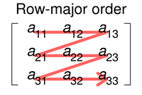
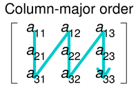
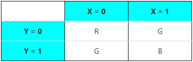
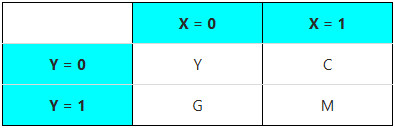
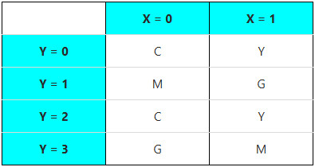
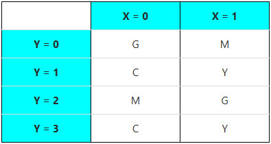
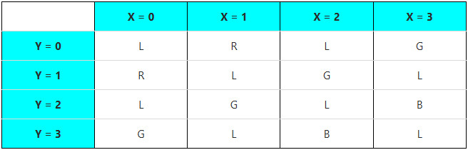

# ASCOM Camera Interface

> This documentation is sourced from the official [ASCOM Camera Interface](https://ascom-standards.org/newdocs/camera.html) documentation.

**See Also:** [ASCOM Exceptions](ascom-exceptions.md) | [Common Types](ascom-common-types.md)

## Methods

### AbortExposure()

**Description:** Abort the current exposure, if any, and returns the camera to Idle state.

**Parameters:** None

**Returns:** Nothing

**Exceptions:**
- `MethodNotImplementedException` - If `CanAbortExposure` is False.
- `InvalidOperationException` - If abort is not currently possible (e.g. during download).
- `NotConnectedException` - If the device is not connected.
- `DriverException` - An error occurred that is not described by one of the more specific ASCOM exceptions.

> **Note:** Unlike `StopExposure()`, this method simply discards any partially-acquired image data and returns the camera to idle. Must not throw an exception if the camera is already idle.

---

### Action()

**Description:** Invoke the specified device-specific custom action.

**Parameters:**
- `ActionName` (`str`) - A name from `SupportedActions` that represents the action to be carried out.
- `ActionParameters` (`str`) - List of required arguments or empty string if none are required.

**Returns:** `str` - Action response. The meaning of returned strings is set by the driver author.

**Exceptions:**
- `MethodNotImplementedException` - If no actions at all are supported.
- `ActionNotImplementedException` - If the driver does not support the requested ActionName.
- `NotConnectedException` - If the device is not connected.
- `DriverException` - An error occurred that is not described by one of the more specific ASCOM exceptions.

> **Note:** Action names must be case insensitive. This method, combined with `SupportedActions`, is the supported mechanic for adding non-standard functionality.

---

### CommandBlind()

**Description:** Transmit an arbitrary string to the device and does not wait for a response.

**Parameters:**
- `Command` (`str`) - The literal command string to be transmitted.
- `Raw` (`bool`) - If True, command is transmitted 'as-is'. If False, then protocol framing characters may be added prior to transmission.

**Returns:** Nothing

**Exceptions:**
- `MethodNotImplementedException` - If the method is not implemented.
- `NotConnectedException` - If the device is not connected.
- `DriverException` - An error occurred that is not described by one of the more specific ASCOM exceptions.

> **Deprecated:** Use the more flexible `Action()` and `SupportedActions` mechanic instead.

---

### CommandBool()

**Description:** Transmit an arbitrary string to the device and wait for a boolean response.

**Parameters:**
- `Command` (`str`) - The literal command string to be transmitted.
- `Raw` (`bool`) - If True, command is transmitted 'as-is'. If False, then protocol framing characters may be added prior to transmission.

**Returns:** `bool` - True/False response from the command.

**Exceptions:**
- `MethodNotImplementedException` - If the method is not implemented.
- `NotConnectedException` - If the device is not connected.
- `DriverException` - An error occurred that is not described by one of the more specific ASCOM exceptions.

> **Deprecated:** Use the more flexible `Action()` and `SupportedActions` mechanic instead.

---

### CommandString()

**Description:** Transmit an arbitrary string to the device and wait for a string response.

**Parameters:**
- `Command` (`str`) - The literal command string to be transmitted.
- `Raw` (`bool`) - If True, command is transmitted 'as-is'. If False, then protocol framing characters may be added prior to transmission.

**Returns:** `str` - String response from the command.

**Exceptions:**
- `MethodNotImplementedException` - If the method is not implemented.
- `NotConnectedException` - If the device is not connected.
- `DriverException` - An error occurred that is not described by one of the more specific ASCOM exceptions.

> **Deprecated:** Use the more flexible `Action()` and `SupportedActions` mechanic instead.

---

### Connect()

**Description:** Connect to the device asynchronously. Use this to connect to a device rather than setting `Connected` to True.

**Parameters:** None

**Returns:** Nothing

**Exceptions:**
- `DriverException` - An error occurred that is not described by one of the more specific ASCOM exceptions.

> **Note:** Non-blocking. On return, `Connecting` must be True unless already connected. Connection has successfully completed when `Connecting` becomes (or is) False.

---

### Disconnect()

**Description:** Disconnect from the device asynchronously. Use this to disconnect from a device rather than setting `Connected` to False.

**Parameters:** None

**Returns:** Nothing

**Exceptions:**
- `DriverException` - An error occurred that is not described by one of the more specific ASCOM exceptions.

> **Note:** Non-blocking. On return, `Connecting` must be True unless already disconnected. Disconnect has successfully completed when `Connecting` becomes (or is) False.

---

### PulseGuide()

**Description:** Activates the Camera's guiding signals, via physical cable(s) connected to the mount, to instruct the mount to move in a particular direction for a given period of time.

**Parameters:**
- `Direction` (`GuideDirections`) - The direction of the move. See `GuideDirections` enumeration.
- `Duration` (`int`) - Duration of the guide move in milliseconds.

**Returns:** Nothing

**Exceptions:**
- `MethodNotImplementedException` - If the camera does not support pulse guiding (`CanPulseGuide` is False).
- `NotConnectedException` - If the device is not connected.
- `DriverException` - An error occurred that is not described by one of the more specific ASCOM exceptions.

> **Note:** Non-blocking. Returns with `IsPulseGuiding` True once pulse-guiding has successfully started. This duplicates the function of `Telescope.PulseGuide()` but with physical connections ("guider cables").

---

### SetupDialog()

**Description:** Launches a configuration dialogue box for the driver. The call will not return until the user clicks OK or cancels manually.

**Parameters:** None

**Returns:** Nothing

**Exceptions:**
- `DriverException` - An error occurred that is not described by one of the more specific ASCOM exceptions.

> **Note:** This method is only valid for COM drivers. Alpaca devices should provide configuration through the Alpaca HTML endpoints.

---

### StartExposure()

**Description:** Start an exposure.

**Parameters:**
- `Duration` (`float`) - The duration of exposure in seconds.
- `Light` (`bool`) - True for light frame, False for dark frame (ignored if no shutter).

**Returns:** Nothing

**Exceptions:**
- `InvalidValueException` - If `Duration` parameter, or any of `BinX`, `BinY`, `StartX`, `StartY`, `NumX`, and `NumY` have invalid or incompatible combinations of values.
- `NotConnectedException` - If the device is not connected.
- `DriverException` - An error occurred that is not described by one of the more specific ASCOM exceptions.

> **Note:** Non-blocking. Returns with `ImageReady` = False if exposure has successfully been started. Use `ImageReady` to check when the exposure is complete and ready for access via `ImageArray`. A dark frame or bias exposure may be shorter than `ExposureMin` and for a bias frame can be zero.

---

### StopExposure()

**Description:** Stop the current exposure, if any, and make available the image data already acquired.

**Parameters:** None

**Returns:** Nothing

**Exceptions:**
- `MethodNotImplementedException` - If the camera cannot stop an in-progress exposure and save the already-acquired image data (`CanStopExposure` is False).
- `InvalidOperationException` - If `CanAsymmetricBin` is False, yet `BinX` != `BinY`.
- `NotConnectedException` - If the device is not connected.
- `DriverException` - An error occurred that is not described by one of the more specific ASCOM exceptions.

> **Note:** Non-blocking. Unlike `AbortExposure()`, this method must cut an exposure short while preserving the image data acquired so far, making it available to the client. Must not raise an exception if the camera is idle.

---

## Properties

### BayerOffsetX

**Type:** `int` (Read-Only)

**Description:** Returns the X offset of the Bayer colour matrix, as defined in property `SensorType`.

**Exceptions:**
- `PropertyNotImplementedException` - If the camera is monochrome.
- `NotConnectedException` - If the device is not connected.
- `DriverException` - An error occurred that is not described by one of the more specific ASCOM exceptions.

> **Note:** Must be implemented by colour cameras. Monochrome cameras must throw a `PropertyNotImplementedException`. The value returned will be in the range 0 to M-1 where M is the X-width of the Bayer matrix.

---

### BayerOffsetY

**Type:** `int` (Read-Only)

**Description:** Returns the Y offset of the Bayer colour matrix, as defined in property `SensorType`.

**Exceptions:**
- `PropertyNotImplementedException` - If the camera is monochrome.
- `NotConnectedException` - If the device is not connected.
- `DriverException` - An error occurred that is not described by one of the more specific ASCOM exceptions.

> **Note:** Must be implemented by colour cameras. Monochrome cameras must throw a `PropertyNotImplementedException`. The value returned will be in the range 0 to M-1 where M is the Y-width of the Bayer matrix.

---

### BinX

**Type:** `int` (Read/Write)

**Description:** Gets or sets the binning factor for the X axis, also returns the current value.

**Exceptions:**
- `InvalidValueException` - If an invalid binning value is written to the property.
- `NotConnectedException` - If the device is not connected.
- `DriverException` - An error occurred that is not described by one of the more specific ASCOM exceptions.

> **Note:** Should default to 1 when the camera connection is established. If `CanAsymmetricBin` is False, then setting this property must result in `BinY` being set to the same value.

---

### BinY

**Type:** `int` (Read/Write)

**Description:** Gets or sets the binning factor for the Y axis, also returns the current value.

**Exceptions:**
- `InvalidValueException` - If an invalid binning value is written to the property.
- `NotConnectedException` - If the device is not connected.
- `DriverException` - An error occurred that is not described by one of the more specific ASCOM exceptions.

> **Note:** Should default to 1 when the camera connection is established. If `CanAsymmetricBin` is False, then setting this property must result in `BinX` being set to the same value.

---

### CameraState

**Type:** `CameraStates` (Read-Only)

**Description:** Returns the current operational state of the camera.

**Exceptions:**
- `NotConnectedException` - If the device is not connected.
- `DriverException` - An error occurred that is not described by one of the more specific ASCOM exceptions.

---

### CameraXSize

**Type:** `int` (Read-Only)

**Description:** Returns the width of the camera sensor in unbinned pixels.

**Exceptions:**
- `NotConnectedException` - If the device is not connected.
- `DriverException` - An error occurred that is not described by one of the more specific ASCOM exceptions.

---

### CameraYSize

**Type:** `int` (Read-Only)

**Description:** Returns the height of the camera sensor in unbinned pixels.

**Exceptions:**
- `NotConnectedException` - If the device is not connected.
- `DriverException` - An error occurred that is not described by one of the more specific ASCOM exceptions.

---

### CanAbortExposure

**Type:** `bool` (Read-Only)

**Description:** Returns True if the camera can abort exposures with `AbortExposure()`, else False.

**Exceptions:**
- `NotConnectedException` - If the device is not connected.
- `DriverException` - An error occurred that is not described by one of the more specific ASCOM exceptions.

---

### CanAsymmetricBin

**Type:** `bool` (Read-Only)

**Description:** Returns True if the camera supports asymmetric binning, else False.

**Exceptions:**
- `NotConnectedException` - If the device is not connected.
- `DriverException` - An error occurred that is not described by one of the more specific ASCOM exceptions.

> **Note:** If True, the camera can have different binning on the X and Y axes. If False, writing to either `BinX` or `BinY` results in the other binning value being set to the same value.

---

### CanFastReadout

**Type:** `bool` (Read-Only)

**Description:** Returns True if the camera supports a fast readout mode. If this is False then the camera may offer `ReadoutModes`.

**Exceptions:**
- `NotConnectedException` - If the device is not connected.
- `DriverException` - An error occurred that is not described by one of the more specific ASCOM exceptions.

> **Deprecated:** `FastReadout` is an obsolete mechanic for controlling camera mode(s). The `ReadoutMode` mechanic should be used.

---

### CanGetCoolerPower

**Type:** `bool` (Read-Only)

**Description:** Returns True if the camera's cooler power level is available via `CoolerPower`, else False.

**Exceptions:**
- `NotConnectedException` - If the device is not connected.
- `DriverException` - An error occurred that is not described by one of the more specific ASCOM exceptions.

---

### CanPulseGuide

**Type:** `bool` (Read-Only)

**Description:** Returns True if the camera supports pulse guiding with electrical "guider cables" via `PulseGuide()`, else False.

**Exceptions:**
- `NotConnectedException` - If the device is not connected.
- `DriverException` - An error occurred that is not described by one of the more specific ASCOM exceptions.

---

### CanSetCCDTemperature

**Type:** `bool` (Read-Only)

**Description:** Returns True if the camera's cooler temperature can be controlled via `SetCCDTemperature`, else False.

**Exceptions:**
- `NotConnectedException` - If the device is not connected.
- `DriverException` - An error occurred that is not described by one of the more specific ASCOM exceptions.

---

### CanStopExposure

**Type:** `bool` (Read-Only)

**Description:** Returns True if the camera can stop exposures via `StopExposure()`, else False.

**Exceptions:**
- `NotConnectedException` - If the device is not connected.
- `DriverException` - An error occurred that is not described by one of the more specific ASCOM exceptions.

> **Note:** Some cameras support `StopExposure()`, which allows the exposure to be terminated before the exposure timer completes, but will still read out the image.

---

### CCDTemperature

**Type:** `float` (Read-Only)

**Description:** Returns the current CCD cooler temperature in degrees Celsius.

**Exceptions:**
- `InvalidOperationException` - If data is unavailable.
- `PropertyNotImplementedException` - If not supported (can't report cooler temperature).
- `NotConnectedException` - If the device is not connected.
- `DriverException` - An error occurred that is not described by one of the more specific ASCOM exceptions.

---

### Connected

**Type:** `bool` (Read/Write)

**Description:** Gets or sets the connected state of the device. Set True to connect to the device hardware. Set False to disconnect from the device hardware.

**Exceptions:**
- `DriverException` - An error occurred that is not described by one of the more specific ASCOM exceptions.

> **Note:** Property-write deprecated as of CameraV4. Use the newer `Connect()` and `Disconnect()` methods instead.

---

### Connecting

**Type:** `bool` (Read-Only)

**Description:** Returns True while the device is undertaking an asynchronous connect or disconnect operation.

**Exceptions:**
- `DriverException` - An error occurred that is not described by one of the more specific ASCOM exceptions.

> **Note:** This is the correct property for determining when the non-blocking methods `Connect()` or `Disconnect()` have completed.

---

### CoolerOn

**Type:** `bool` (Read/Write)

**Description:** Turns the camera cooler on and off and returns the current cooler on/off state.

**Exceptions:**
- `PropertyNotImplementedException` - If not supported.
- `NotConnectedException` - If the device is not connected.
- `DriverException` - An error occurred that is not described by one of the more specific ASCOM exceptions.

> **Warning:** For some cameras, turning the cooler off when the cooler is operating at high delta-T (typically >20C below ambient) may result in thermal shock.

---

### CoolerPower

**Type:** `float` (Read-Only)

**Description:** Returns the current cooler power level in percent.

**Exceptions:**
- `PropertyNotImplementedException` - If not supported.
- `NotConnectedException` - If the device is not connected.
- `DriverException` - An error occurred that is not described by one of the more specific ASCOM exceptions.

> **Note:** Must return zero if `CoolerOn` is False.

---

### Description

**Type:** `str` (Read-Only)

**Description:** Returns a description of the device such as manufacturer and model number. Any ASCII characters may be used.

**Exceptions:**
- `NotConnectedException` - If the device is not connected.
- `DriverException` - An error occurred that is not described by one of the more specific ASCOM exceptions.

> **Note:** The description length must be a maximum of 64 characters so that it can be used in FITS image headers.

---

### DeviceState

**Type:** `List[StateValue]` (Read-Only)

**Description:** Returns an array of `StateValue` objects representing the operational properties of this device.

**Exceptions:**
- `DriverException` - An error occurred that is not described by one of the more specific ASCOM exceptions.

> **Note:** This device must return the following operational properties if known: `CameraState`, `CCDTemperature`, `CoolerPower`, `HeatSinkTemperature`, `ImageReady`, `IsPulseGuiding`, `PercentCompleted`, and `TimeStamp`.

---

### DriverInfo

**Type:** `str` (Read-Only)

**Description:** Returns descriptive and version information about the ASCOM driver.

**Exceptions:**
- `DriverException` - An error occurred that is not described by one of the more specific ASCOM exceptions.

> **Note:** This string may contain line endings and may be hundreds to thousands of characters long. It is intended to display detailed information on the ASCOM driver, including version and copyright data.

---

### DriverVersion

**Type:** `str` (Read-Only)

**Description:** Returns a string containing only the major and minor version of the driver.

**Exceptions:**
- `DriverException` - An error occurred that is not described by one of the more specific ASCOM exceptions.

> **Note:** This must be in the form "n.n". It should not be confused with `InterfaceVersion`, which is the version of the ASCOM specification supported by the driver.

---

### ElectronsPerADU

**Type:** `float` (Read-Only)

**Description:** Returns the gain of the camera in photoelectrons per A/D unit in its current modes.

**Exceptions:**
- `PropertyNotImplementedException` - If this property is not available for the camera.
- `NotConnectedException` - If the device is not connected.
- `DriverException` - An error occurred that is not described by one of the more specific ASCOM exceptions.

> **Note:** At run-time, a change to `BinX`, `BinY`, `Gain`, `Offset`, or `ReadoutMode` which results in this value changing must be reflected immediately.

---

### ExposureMax

**Type:** `float` (Read-Only)

**Description:** Returns the maximum exposure time (seconds) supported by `StartExposure()`.

**Exceptions:**
- `NotConnectedException` - If the device is not connected.
- `DriverException` - An error occurred that is not described by one of the more specific ASCOM exceptions.

---

### ExposureMin

**Type:** `float` (Read-Only)

**Description:** Returns the minimum exposure time (seconds) supported by `StartExposure()`.

**Exceptions:**
- `NotConnectedException` - If the device is not connected.
- `DriverException` - An error occurred that is not described by one of the more specific ASCOM exceptions.

> **Note:** This must be a non-zero number representing the shortest possible exposure time supported by the camera model. For bias frame acquisition, an even shorter exposure may be possible.

---

### ExposureResolution

**Type:** `float` (Read-Only)

**Description:** Returns the smallest increment in exposure time (seconds) supported by `StartExposure()`.

**Exceptions:**
- `NotConnectedException` - If the device is not connected.
- `DriverException` - An error occurred that is not described by one of the more specific ASCOM exceptions.

> **Note:** A value of 0.0 indicates that there is no minimum resolution except that imposed by the resolution of the float data type.

---

### FastReadout

**Type:** `bool` (Read/Write)

**Description:** Enables the camera's FastReadout mode if available, and gets the current state of FastReadout mode.

**Exceptions:**
- `PropertyNotImplementedException` - If FastReadout is not supported (`CanFastReadout` is False).
- `NotConnectedException` - If the device is not connected.
- `DriverException` - An error occurred that is not described by one of the more specific ASCOM exceptions.

> **Deprecated:** `FastReadout` is an obsolete mechanic for controlling camera mode(s). The `ReadoutMode` mechanic should be used instead.

---

### FullWellCapacity

**Type:** `float` (Read-Only)

**Description:** Returns the maximum number of photoelectrons that can be held by a single pixel in the camera's current modes.

**Exceptions:**
- `PropertyNotImplementedException` - If this property is not available for the camera.
- `NotConnectedException` - If the device is not connected.
- `DriverException` - An error occurred that is not described by one of the more specific ASCOM exceptions.

> **Note:** At run-time, a change to `BinX`, `BinY`, `Gain`, `Offset`, or `ReadoutMode` which results in this value changing must be reflected immediately.

---

### Gain

**Type:** `int` (Read/Write)

**Description:** Gets or sets the current gain value or gains index per its current gain-setting operating mode.

**Exceptions:**
- `PropertyNotImplementedException` - If `Gain` is not supported at all.
- `InvalidValueException` - If the supplied value is not valid.
- `NotConnectedException` - If the device is not connected.
- `DriverException` - An error occurred that is not described by one of the more specific ASCOM exceptions.

> **Note:** The `Gain` property operates in one of two modes:
> - **Gains Index mode:** The `Gain` property is the selected gain's index within the `Gains` array of textual gain names.
> - **Gain Value mode:** The `Gain` property is a direct numeric representation of the camera's gain.

---

### GainMax

**Type:** `int` (Read-Only)

**Description:** Returns the maximum gain value that this camera supports in Gain Value mode.

**Exceptions:**
- `PropertyNotImplementedException` - If `Gain` is not supported at all or if the camera is operating in Gains Index mode.
- `NotConnectedException` - If the device is not connected.
- `DriverException` - An error occurred that is not described by one of the more specific ASCOM exceptions.

---

### GainMin

**Type:** `int` (Read-Only)

**Description:** Returns the minimum gain value that this camera supports in Gain Value mode.

**Exceptions:**
- `PropertyNotImplementedException` - If `Gain` is not supported at all or if the camera is operating in Gains Index mode.
- `NotConnectedException` - If the device is not connected.
- `DriverException` - An error occurred that is not described by one of the more specific ASCOM exceptions.

---

### Gains

**Type:** `List[str]` (Read-Only)

**Description:** Returns a 0-based array of Gain names supported by the camera when in Gains Index mode.

**Exceptions:**
- `PropertyNotImplementedException` - If `Gain` is not supported at all or if the camera is operating in Gain Value mode.
- `NotConnectedException` - If the device is not connected.
- `DriverException` - An error occurred that is not described by one of the more specific ASCOM exceptions.

---

### HasShutter

**Type:** `bool` (Read-Only)

**Description:** Returns True if the camera has a mechanical shutter, else False.

**Exceptions:**
- `NotConnectedException` - If the device is not connected.
- `DriverException` - An error occurred that is not described by one of the more specific ASCOM exceptions.

> **Note:** If `HasShutter` is False, the `StartExposure()` method must ignore the `Light` parameter.

---

### HeatSinkTemperature

**Type:** `float` (Read-Only)

**Description:** Returns the current heat sink (aka "ambient") temperature in degrees Celsius.

**Exceptions:**
- `PropertyNotImplementedException` - If the camera has no cooler.
- `NotConnectedException` - If the device is not connected.
- `DriverException` - An error occurred that is not described by one of the more specific ASCOM exceptions.

---

### ImageArray

**Type:** `List[List[int]]` or `List[List[List[int]]]` (Read-Only)

**Description:** Returns an array containing the exposure pixel values in ADU.

**Exceptions:**
- `InvalidOperationException` - If no image data is available (`ImageReady` is False).
- `NotConnectedException` - If the device is not connected.
- `DriverException` - An error occurred that is not described by one of the more specific ASCOM exceptions.

> **Note:** The array will have dimensions of `NumX` by `NumY` as set at the time `StartExposure()` was called. Full color images will include a "plane" for each color, with the additional plane index following the X and Y indices.

#### Array Ordering

ASCOM uses **row-major order** for image arrays:

For comparison, column-major order (NOT used by ASCOM):

---

### ImageArrayVariant

**Type:** `List[List[object]]` or `List[List[List[object]]]` (Read-Only)

**Description:** Returns an array containing the exposure pixel values in ADU as COM Variant types.

**Exceptions:**
- `PropertyNotImplementedException` - Unless the driver is for ASCOM/COM on Windows OS.
- `InvalidOperationException` - If no image data is available (`ImageReady` is False).
- `NotConnectedException` - If the device is not connected.
- `DriverException` - An error occurred that is not described by one of the more specific ASCOM exceptions.

> **Note:** This property is only valid for Windows ASCOM/COM drivers. Alpaca drivers and stand-alone (Alpaca) cameras must raise `PropertyNotImplementedException`.

---

### ImageReady

**Type:** `bool` (Read-Only)

**Description:** Returns True if the requested exposure has completed and `ImageArray` contains the image ready to be read.

**Exceptions:**
- `NotConnectedException` - If the device is not connected.
- `DriverException` - An error occurred that is not described by one of the more specific ASCOM exceptions.

> **Note:** `ImageReady` will be False immediately upon return from `StartExposure()`. It will remain False until the exposure has been successfully completed and an image is ready for retrieval via `ImageArray`.

---

### InterfaceVersion

**Type:** `int` (Read-Only)

**Description:** Returns the ASCOM Device interface definition version that this device supports. Should return 4 for ICameraV4.

**Exceptions:**
- `DriverException` - An error occurred that is not described by one of the more specific ASCOM exceptions.

---

### IsPulseGuiding

**Type:** `bool` (Read-Only)

**Description:** Returns True if the camera is currently executing a `PulseGuide()` operation.

**Exceptions:**
- `PropertyNotImplementedException` - If the camera does not support pulse guiding (`CanPulseGuide` is False).
- `NotConnectedException` - If the device is not connected.
- `DriverException` - An error occurred that is not described by one of the more specific ASCOM exceptions.

---

### LastExposureDuration

**Type:** `float` (Read-Only)

**Description:** Returns the actual duration of the last exposure in seconds.

**Exceptions:**
- `PropertyNotImplementedException` - If the camera doesn't support this feature.
- `InvalidOperationException` - If no image has yet been successfully acquired.
- `NotConnectedException` - If the device is not connected.
- `DriverException` - An error occurred that is not described by one of the more specific ASCOM exceptions.

> **Note:** This may differ from the exposure duration requested due to shutter latency, camera timing precision, etc.

---

### LastExposureStartTime

**Type:** `str` (Read-Only)

**Description:** Returns the UTC start time of the last exposure in FITS standard format ISO-8601.

**Exceptions:**
- `PropertyNotImplementedException` - If the camera doesn't support this feature.
- `InvalidOperationException` - If no image has yet been successfully acquired.
- `NotConnectedException` - If the device is not connected.
- `DriverException` - An error occurred that is not described by one of the more specific ASCOM exceptions.

> **Note:** Returns the actual exposure UTC start date/time in the FITS-standard / ISO-8601 `CCYY-MM-DDThh:mm:ss[.sss...]` format.

---

### MaxADU

**Type:** `int` (Read-Only)

**Description:** Returns the maximum possible ADU value that the camera can produce in its current mode.

**Exceptions:**
- `NotConnectedException` - If the device is not connected.
- `DriverException` - An error occurred that is not described by one of the more specific ASCOM exceptions.

---

### MaxBinX

**Type:** `int` (Read-Only)

**Description:** Returns the maximum supported X binning value of the camera in its current modes.

**Exceptions:**
- `NotConnectedException` - If the device is not connected.
- `DriverException` - An error occurred that is not described by one of the more specific ASCOM exceptions.

---

### MaxBinY

**Type:** `int` (Read-Only)

**Description:** Returns the maximum supported Y binning value of the camera in its current modes.

**Exceptions:**
- `NotConnectedException` - If the device is not connected.
- `DriverException` - An error occurred that is not described by one of the more specific ASCOM exceptions.

---

### Name

**Type:** `str` (Read-Only)

**Description:** Returns the short name of the driver, for display purposes.

**Exceptions:**
- `DriverException` - An error occurred that is not described by one of the more specific ASCOM exceptions.

---

### NumX

**Type:** `int` (Read/Write)

**Description:** Set or return the current (sub)frame width. Combined with `StartX` > 0 to specify a subframe in the X dimension.

**Exceptions:**
- `NotConnectedException` - If the device is not connected.
- `DriverException` - An error occurred that is not described by one of the more specific ASCOM exceptions.

> **Note:** If binning is active, value is in binned pixels. Must default to `CameraXSize` with `StartX` = 0 and `BinX` = 1 (full frame unbinned) on initial camera startup.

---

### NumY

**Type:** `int` (Read/Write)

**Description:** Set or return the current (sub)frame height. Combined with `StartY` > 0 to specify a subframe in the Y dimension.

**Exceptions:**
- `NotConnectedException` - If the device is not connected.
- `DriverException` - An error occurred that is not described by one of the more specific ASCOM exceptions.

> **Note:** If binning is active, value is in binned pixels. Must default to `CameraYSize` with `StartY` = 0 and `BinY` = 1 (full frame unbinned) on initial camera startup.

---

### Offset

**Type:** `int` (Read/Write)

**Description:** Gets or sets the current offset value or offsets index per its current offset-setting operating mode.

**Exceptions:**
- `PropertyNotImplementedException` - If `Offset` is not supported at all.
- `InvalidValueException` - If the supplied value is not valid.
- `NotConnectedException` - If the device is not connected.
- `DriverException` - An error occurred that is not described by one of the more specific ASCOM exceptions.

> **Note:** The `Offset` property operates in one of two modes:
> - **Offsets Index mode:** The `Offset` property is the selected offset's index within the `Offsets` array of textual offset names.
> - **Offset Value mode:** The `Offset` property is a direct numeric representation of the camera's offset.

---

### OffsetMax

**Type:** `int` (Read-Only)

**Description:** Returns the maximum offset value that this camera supports in Offset Value mode.

**Exceptions:**
- `PropertyNotImplementedException` - If `Offset` is not supported at all or if the camera is operating in Offsets Index mode.
- `NotConnectedException` - If the device is not connected.
- `DriverException` - An error occurred that is not described by one of the more specific ASCOM exceptions.

---

### OffsetMin

**Type:** `int` (Read-Only)

**Description:** Returns the minimum offset value that this camera supports in Offset Value mode.

**Exceptions:**
- `PropertyNotImplementedException` - If `Offset` is not supported at all or if the camera is operating in Offsets Index mode.
- `NotConnectedException` - If the device is not connected.
- `DriverException` - An error occurred that is not described by one of the more specific ASCOM exceptions.

---

### Offsets

**Type:** `List[str]` (Read-Only)

**Description:** Returns a 0-based array of Offset names supported by the camera when in Offsets Index mode.

**Exceptions:**
- `PropertyNotImplementedException` - If `Offset` is not supported at all or if the camera is operating in Offset Value mode.
- `NotConnectedException` - If the device is not connected.
- `DriverException` - An error occurred that is not described by one of the more specific ASCOM exceptions.

---

### PercentCompleted

**Type:** `int` (Read-Only)

**Description:** Returns the percentage completeness (0% - 100%) of the current exposure in progress.

**Exceptions:**
- `PropertyNotImplementedException` - If `PercentCompleted` is not supported.
- `InvalidOperationException` - When `CameraState` is inappropriate for reading `PercentCompleted`.
- `NotConnectedException` - If the device is not connected.
- `DriverException` - An error occurred that is not described by one of the more specific ASCOM exceptions.

> **Note:** Valid when `CameraState` is in any or all of the following states: `cameraExposing`, `cameraWaiting`, `cameraReading`, `cameraDownload`.

---

### PixelSizeX

**Type:** `float` (Read-Only)

**Description:** Returns the physical width (microns) of the camera sensor elements.

**Exceptions:**
- `NotConnectedException` - If the device is not connected.
- `DriverException` - An error occurred that is not described by one of the more specific ASCOM exceptions.

---

### PixelSizeY

**Type:** `float` (Read-Only)

**Description:** Returns the physical height (microns) of the camera sensor elements.

**Exceptions:**
- `NotConnectedException` - If the device is not connected.
- `DriverException` - An error occurred that is not described by one of the more specific ASCOM exceptions.

---

### ReadoutMode

**Type:** `int` (Read/Write)

**Description:** Gets or sets the index of the current camera readout mode in `ReadoutModes` array.

**Exceptions:**
- `PropertyNotImplementedException` - If `CanFastReadout` is True.
- `InvalidValueException` - If the supplied value is not valid (index out of range).
- `NotConnectedException` - If the device is not connected.
- `DriverException` - An error occurred that is not described by one of the more specific ASCOM exceptions.

> **Note:** ReadoutModes provide a simple way to select combinations of gain, offset, analog-to-digital converter bit depth, and other operational parameters. Defaults to 0 if not set. It is strongly recommended that cameras make the 0-index mode suitable for standard imaging operations.

---

### ReadoutModes

**Type:** `List[str]` (Read-Only)

**Description:** Returns a 0-based array of ReadoutMode names supported by the camera.

**Exceptions:**
- `PropertyNotImplementedException` - If `CanFastReadout` is True.
- `NotConnectedException` - If the device is not connected.
- `DriverException` - An error occurred that is not described by one of the more specific ASCOM exceptions.

> **Note:** The default readout mode (on startup) must be `ReadoutModes[0]`. The device should reserve this for "standard" imaging operations since it is the power-up default.

---

### SensorName

**Type:** `str` (Read-Only)

**Description:** Returns the name of the sensor used within the camera.

**Exceptions:**
- `NotConnectedException` - If the device is not connected.
- `DriverException` - An error occurred that is not described by one of the more specific ASCOM exceptions.

> **Note:** Returns the name (data sheet part number) of the sensor, e.g. ICX285. Must return an empty string if the sensor name is not known. All letters shall be uppercase, spaces shall not be included.

---

### SensorType

**Type:** `SensorType` (Read-Only)

**Description:** Returns the type of sensor within the camera.

**Exceptions:**
- `PropertyNotImplementedException` - If the sensor type is unknown or the device just doesn't support this.
- `NotConnectedException` - If the device is not connected.
- `DriverException` - An error occurred that is not described by one of the more specific ASCOM exceptions.

---

### SetCCDTemperature

**Type:** `float` (Read/Write)

**Description:** Get or set the camera's cooler setpoint (degrees Celsius).

**Exceptions:**
- `InvalidValueException` - If an attempt is made to set a value that is outside the camera's valid temperature setpoint range.
- `PropertyNotImplementedException` - If `CanSetCCDTemperature` is False.
- `NotConnectedException` - If the device is not connected.
- `DriverException` - An error occurred that is not described by one of the more specific ASCOM exceptions.

> **Note:** Setting this property must be short-lived because it is only expected to establish the new setpoint and must not block until the setpoint has been reached or otherwise wait for any actual temperature changes.

---

### StartX

**Type:** `int` (Read/Write)

**Description:** Set or return the current X-axis start position in binned pixels.

**Exceptions:**
- `NotConnectedException` - If the device is not connected.
- `DriverException` - An error occurred that is not described by one of the more specific ASCOM exceptions.

> **Note:** If binning is active, value is in binned pixels. Defaults to 0 with `NumX` = `CameraXSize` (full frame) on initial camera startup.

---

### StartY

**Type:** `int` (Read/Write)

**Description:** Set or return the current Y-axis start position in binned pixels.

**Exceptions:**
- `NotConnectedException` - If the device is not connected.
- `DriverException` - An error occurred that is not described by one of the more specific ASCOM exceptions.

> **Note:** If binning is active, value is in binned pixels. Defaults to 0 with `NumY` = `CameraYSize` (full frame) on initial camera startup.

---

### SubExposureDuration

**Type:** `float` (Read/Write)

**Description:** Sets the camera's sub-exposure interval (seconds) for on-board stacking.

**Exceptions:**
- `PropertyNotImplementedException` - If the camera does not support on-board stacking with user-supplied sub-exposure interval.
- `InvalidValueException` - The supplied duration is not valid (negative or zero).
- `NotConnectedException` - If the device is not connected.
- `DriverException` - An error occurred that is not described by one of the more specific ASCOM exceptions.

> **Note:** This property provides for a camera to divide an exposure interval (as given to `StartExposure()`) into separate sub-exposures, then stack them internally, returning the final exposure to the client.

---

### SupportedActions

**Type:** `List[str]` (Read-Only)

**Description:** Returns the list of custom action names supported by this driver, to be used with `Action()`.

**Exceptions:**
- `DriverException` - An error occurred that is not described by one of the more specific ASCOM exceptions.

> **Note:** This method, combined with `Action()`, is the supported mechanic for adding non-standard functionality.

---

## Enumerated Constants

### CameraStates

Current condition of the Camera.

| Symbol | Value | Description |
|--------|-------|-------------|
| `cameraIdle` | 0 | At idle state, available to start exposure |
| `cameraWaiting` | 1 | Exposure started but waiting (for shutter, trigger, filter wheel, etc.) |
| `cameraExposing` | 2 | Exposure currently in progress |
| `cameraReading` | 3 | Sensor array is being read out (digitized) |
| `cameraDownloading` | 4 | Downloading data to host |
| `cameraError` | 5 | Camera error condition serious enough to prevent further operations |

---

### GuideDirections

The direction in which the guide-rate motion is to be made.

| Symbol | Value | Description |
|--------|-------|-------------|
| `guideNorth` | 0 | North (+ declination) |
| `guideSouth` | 1 | South (- declination) |
| `guideEast` | 2 | East (+ right ascension) |
| `guideWest` | 3 | West (- right ascension) |

---

### SensorType

Type of sensor in the Camera.

| Symbol | Value | Description |
|--------|-------|-------------|
| `Monochrome` | 0 | Single-plane monochrome |
| `Color` | 1 | Multiple-plane Color |
| `RGGB` | 2 | Single-plane Bayer matrix RGGB |
| `CMYG` | 3 | Single-plane Bayer matrix CMYG |
| `CMYG2` | 4 | Single-plane Bayer matrix CMYG2 |
| `LRGB` | 5 | Single-plane Bayer matrix LRGB |

#### Bayer Pattern Examples

**RGGB (most common):**

**CMYG:**

**CMYG2:**

**CMYG2 with offset:**

**LRGB:**

