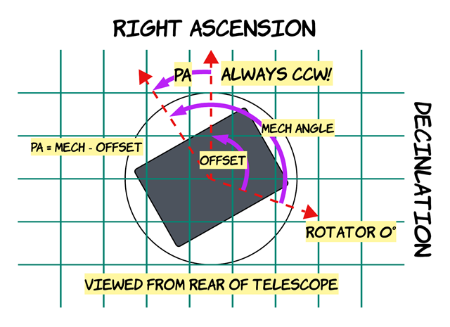
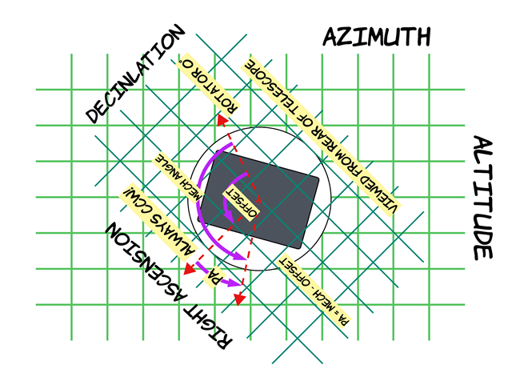
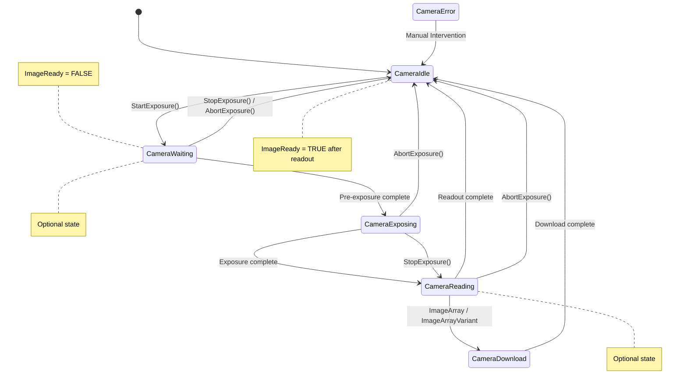

# ASCOM Frequently Asked Questions

> This documentation is sourced from the official [ASCOM FAQ](https://ascom-standards.org/newdocs/faq.html) documentation.

## Asynchronous Operations in ASCOM

As of this release of the ASCOM Interfaces (both COM and Alpaca), asynchronous methods are provided for all operations. Some older methods are not asynchronous, and they are now deprecated. For details on how the transition to "all asynchronous" was accomplished, and the changes that made this possible see the Release Notes for Interfaces as of ASCOM Platform 7.

### Background for Developers

An asynchronous operation uses two interface members: an initiator method to start the operation and a completion property that can be polled to monitor the operation's progress.

Fundamentally, an asynchronous method initiates an operation and returns immediately, enabling the caller (an app) to read properties, including the completion property, and possibly initiate other operations in parallel. If, during initiation, the device knows that it cannot successfully complete the requested operation, it must raise an exception instead of returning from the method call.

There are subtleties and consequences to this mode of operation. To help developers, we have provided developer information on the details of asynchronous operations in ASCOM on our main website in the document [Asynchronous Programming and Exceptions](https://ascom-standards.org/AlpacaDeveloper/Async.htm) (external). Please consider looking at this.

### How can I tell if my asynchronous request fails?

This section is written from an *app developer's* point of view.

All asynchronous (non-blocking) methods in ASCOM are paired with corresponding completion properties that allow you to determine if the operation (running in the background) has finished. There are *two places* where a requested async operation can fail:

1. When you call the method that starts the operation, for example `Move()`. If you get an exception here, it means the device couldn't *start* the operation, for whatever reason. Common reasons include an out-of-range request or an unconnected device.

2. Later you read the completion property that tells you whether the async operation has finished, for example `IsMoving`. If you see the value change to indicate that the operation has finished, you can be *100% certain that it completed successfully*. On the other hand, if you get an exception here (often a `DriverException`), it means the device *failed to finish the operation successfully*. In this case, the device is compromised and requires special attention.

### What do I do if something goes wrong?

This section is written from a *device / driver developer's* point of view.

If you determine that the operation cannot be started when the initiator method is called, e.g. a supplied parameter is incorrect or the device is not connected, the method must raise an exception rather than returning to the caller.

If something goes wrong after the operation has been initiated, report this to the client by raising an exception when the client tries to read the completion property. The exception should continue to be raised on each attempt to read the completion property until it is reset at the start of the next operation that uses that completion property.

> **Tip:** Have a look at this article [Why exceptions in async methods are "dangerous" in C#](https://medium.com/@alexandre.malavasi/why-exceptions-in-async-methods-are-dangerous-in-c-fda7d382b0ff) (external). While the article uses the C# language and async/await to illustrate the so-called "dangers" (failing to await), the exact same principles apply here. For example you really must use `Focuser.IsMoving` to determine completion of a `Focuser.Move()`. `Focuser.IsMoving` is the 'await' in this cross-language/cross-platform environment. If you ignore `Focuser.IsMoving` and instead "double-check" the results by comparing your request with the results, you run several risks, including:
>
> 1. A lost exception (an integrity bust),
> 2. A false completion indication if the device passes through the requested position on its way to settling to its final place, and
> 3. Needing to decide what "close enough" means.
>
> Plus it needlessly complicates your code. We have to design for, and require, trustworthy devices/drivers.

## The Switch Interface

The Switch interface is designed to provide control of a variety of sources of power including ordinary power outlets as well as variable output power sources. There are a few confusing aspects of this interface, and this article will try to shed some light on them. The interface provides support for one or more "switches".

In the specification, an on/off outlet type, an on/off sensor type, a variable output rheostat type, and a variable value sensor type, are all referred to as a *switch*.

- An on-off outlet is controlled by `SetSwitch()` and read back by `GetSwitch()`.
- Rheostat switches are controlled by `SetSwitchValue()` and read back by `GetSwitchValue()`.
- If the `CanWrite` property of a switch is `False` then it is not a controllable switch, it is a sensor, and can only be read back via `GetSwitch()` and `GetSwitchValue()`.

> **Note:** Despite its name, `MaxSwitch` is not the maximum value of the `Id` for a switch, it is the total number of switches supported by the device. The maximum legal value for `Id` for a switch device is `MaxSwitch - 1`. Think of `MaxSwitch` as the size of an array with indices ranging from 0 to `MaxSwitch - 1`.

### For Application Developers

**[Q] How do I turn an outlet on and off?**

Given the switch number (or `Id`), call `SetSwitch()` with the `Id` and `True` or `False` for on or off respectively. You can read back the state of an outlet by calling `GetSwitch()` with the `Id`. The allowable range of `Id` values is from `0` through `MaxSwitch - 1`.

**[Q] How do I control the output level of a rheostat?**

Given the switch number (or `Id`), call `SetSwitchValue()` with the `Id` and the output level you want. You can read back the output level by calling `GetSwitchValue()` with the `Id`. The allowable range of output levels is given by `MinSwitchValue()` and `MaxSwitchValue()`. The allowable range of `Id` values is from `0` through `MaxSwitch - 1`.

**[Q] How can I tell if a switch is an outlet type (on/off) or a rheostat?**

When the difference between `MinValue` and `MaxValue` equals the value of `SwitchStep` you can assume that the switch is a binary on/off switch.

**[Q] How do I tell if a switch is controllable or just a sensor?**

Read the switch's `CanWrite()` value using the switch's `Id`.

**[Q] I can't set the variable value I want. It keeps coming back different**

Besides `MinSwitchValue()` and `MaxSwitchValue()`, the switch's output values may be restricted to successive steps given by `SwitchStep()` increments. Unfortunately, setting the switch to an unsupported value (not one of the steps) does not result in an exception, instead it will be set by rounding up to next higher legal value. See the related question for developers below.

### For Device Developers

The behavior of your switch device can be inferred from the above section.

> **Note:** A confusing aspect of this interface is that the `Value` methods must be implemented even for on/off switches, and the on/off methods must be implemented even for output value switches.

**[Q] What must I do with the Value methods for my simple on/off switches?**

Make the `Value` methods use a value of 0.0 to 1.0. For `MinSwitchValue()` return 0, and for `MaxSwitchValue()` return 1.0. Then make `SetSwitchValue()` take `1.0` or `0.0` for on and off respectively. `GetSwitchValue()` must return `1.0` for on and `0.0` for off. Implied by this is that `SwitchStep()` should return 1.0, just one step from 0.0 to 1.0.

**[Q] What happens to a variable value switch when SetSwitchValue sets a value between steps as defined by SwitchStep?**

The output value should be rounded to the nearest step. For example say `MinSwitchValue() = 5.0`, `MaxSwitchValue() = 8.0`, and `SwitchStep() = 1.0`, then:

- Values in the range of 5.0 to 5.499999 => 5.0
- Values in the range of 5.5 to 6.499999 => 6.0
- Values in the range of 6.0 to 7.499999 => 7.0
- Values in the range of 7.5 to 8.0 => 8.0

**[Q] What must I do with SetSwitch() for my variable value switches?**

A call to `SetSwitch()` `True` must set the value to `MaxSwitchValue()`. A call to `SetSwitch()` `False` must set the value to `MinSwitchValue()`.

**[Q] What must I do with GetSwitch() for my variable value switches?**

A call to `GetSwitch()` must return `False` if the value is at `MinSwitchValue()`, otherwise `True`.

**[Q] Conform is reporting an error for my SwitchStep() value. What could be the problem?**

The specs require that `(int(MaxSwitchValue) - int(MinSwitchValue))` must be an exact multiple of `int(SwitchStep)`.

**[Q] My variable output device has continuous values. What must I return for SwitchStep()?**

Since `SwitchStep()` cannot be 0, return a "small" step that relates to the resolution of the A/D converter or to practical usefulness. As just mentioned, be sure to choose a `SwitchStep()` value that gives rise to an even number of steps within the range.

**[Q] How can I "turn off" a variable value switch with a non-zero MinSwitchValue()?**

Use a separate switch for on/off. An example might be a dew heater with 5 - 10 volts output. Make one on/off switch with `SwitchName()` of "DewOnOff", with `SwitchDescription()` of "Dew Heater Power On/Off". Then label the variable output switch "DewPower" with `SwitchDescription()` of "Dew Heater Output Power Level (low to high)".

**[Q] How can I create a "momentary switch" effect?**

A momentary switch activates for a short period when triggered before self-resetting, but there is no direct analogue of this behaviour in the ASCOM switch device. Momentary action can be implemented using an ASCOM switch by activating the momentary action on only one of the `SetSwitch()` operations, either `True` or `False` leaving the other to have no effect.

## The Dome Interface

The Dome interface is designed to handle any type of enclosure including classic domes with a slit having a single shutter, split shutter, clamshells, rotatable clamshells, rolloffs, split rolloffs, well really anything. The concept is that the Dome must provide an "aperture to the sky" and a way to open and close the aperture.

The dome controller can optionally receive both azimuth and altitude commands from the application. For example, a clamshell controller that gets both azimuth and altitude could optimize the position of the leaves, minimizing exposure to wind. This could be even better if the clamshell rotates. The Dome Interface allows a driver to advertise this by returning True for both `CanSetAzimuth` and `CanSetAltitude`.

**[Q] How do I provide for a roll-off roof?**

**[A]** Return `CanSetAzimuth = False` and `CanSetAltitude() = False`. This tells the client that there is no way to adjust the opening to the sky at all. The only functions available will be those related to opening and closing the roof or clamshell to provide access to the entire sky (or not).

**[Q] How do I provide for a rotating dome with a simple shutter?**

**[A]** Return `CanSetAltitude = False` if you have a common dome with a rotatable opening (e.g., a slit). The client can use `SlewToAzimuth()` to position the slit, and of course `OpenShutter()` and `CloseShutter()`.

**[Q] What are the exact meanings of `Azimuth` and `Altitude`?**

**[A]** The specified azimuth and altitude (*referenced to the dome center/equator*) give the position on the sky that the observer wishes to observe. It is up to the device to determine how best to locate the dome aperture in order to expose that part of the sky to the telescope. This means that the mechanical position to which the Dome moves may not correspond exactly to requested observing azimuth and altitude because the device must coordinate multiple shutters, clamshell segments or roof mechanisms to provide the required aperture on the sky.

**[Q] How can I adjust the location of the opening (slit, port, clamshell leaves) to account for the geometry and offset of the optics?**

**[A]** The Dome interface does not provide for this, as it requires current pointing information from the mount/telescope, as well as mount configuration and measurements. This is a composite task requiring information about two devices, and is thus out of scope for a Dome device by itself.

Normally this must be done by an application which connects to a Telescope and a Dome, stores relevant geometric info about both, then calculates the dome slit azimuth (and maybe altitude) for slews, as well as periodically adjusting the dome's azimuth ("slaving") as the telescope tracks across the sky.

**[Q] OK, where can I find info on the calculations?**

**[A]** The most general and easy to understand paper is [Dome Calculation by Nicolas de Hilster](https://www.dehilster.info/astronomy/dome_azimuth_calculation.php). It includes provisions for side-by-side multiple OTAs. Included is a live workbench which you can use to test your calculations for a mount with side-by-side multiple OTAs. There is [a discussion of this on the ASCOM Developers Forum](https://ascomtalk.groups.io/g/Developer/topic/relationship_between_scope/100953391).

**[Q] I see that the Dome interface has `CanSlave` and `Slaved` properties. Why are they present if a dome controller can't slave?**

**[A]** There are a few integrated/combined telescope/mount/dome control systems (COMSOFT PC/TCS, DFM TCS, for example) which expose both Telescope and Dome interfaces. The slaving properties in the ASCOM Dome interface are provided for these types of control systems.

## MaxADU, ElectronsPerADU, and FullWellCapacity

The `MaxADU`, `ElectronsPerADU`, and `FullWellCapacity` are characteristic properties which describe the camera sensor and its analog-to-digital converter (ADC). The last two are essential parameters for scientific imaging.

### Values Must Reflect Current Camera Modes

The primary application use case for these properties is (1) Establish the operating modes, (2) Acquire the image, and (3) Query the interface to determine these properties. However, these properties must be available before the first image is acquired, in other words, immediately on startup (with default values). Also, after making a change to relevant properties such as `BinX`, `BinY`, `Gain`, `Offset`, or `ReadoutMode`, or via the camera's setup dialog, the mode change(s) must be immediately reflected in these properties.

### Purpose of MaxADU

`MaxADU` is provided for imaging applications so they may know the *maximum* range of ADU values to expect from a camera in `ImageArray` and therefore may establish their display scaling, etc.

### Meaning of MaxADU

`MaxADU` is a characteristic of the camera, not of the current image (if any). It must be the maximum ADU value that can *ever* be output by the camera sensor and its analog-to-digital converter (ADC) *in its current operating modes*. Usually this would correspond to the current bit depth as `2^bitdepth - 1`. However if, by design, a camera is limited *in its current modes* to an ADU value that is *significantly* lower than `2^bitdepth - 1`, it must report the maximum possible pixel value (the upper limit).

For example if the camera's ADC is 12 bit, but by design, and *in the camera's current modes*, the sensor can only ever produce a 12-bit digitized pixel value of 3800 (a significantly lower value), then `MaxADU` must report 3800, and not `2^12 - 1 = 4095`.

### Inflation of Data Values - Upscaling to Higher Bit Depth

This specification strongly discourages inflating the pixel values coming from the analog to digital converter (ADC) to create the illusion that the camera is capable of a higher bit depth than it actually is. This includes not interpolating between real ADU values to smooth the inflated data between inflated values. ADUs should increase and decrease in steps of 1. Cameras that inflate values are essentially useless for science.

## TimeStamp Value

Each `DeviceState` list may optionally include a `TimeStamp` element so that the device can record the time at which the operational states were measured, when known. The (string) [ISO 8601 time format](https://www.iso.org/iso-8601-date-and-time-format.html) must be used to report:

- An unqualified local time e.g. `2016-03-04T17:45:31.1234567`, which corresponds to `17:45:31.1234567` local time on `4th March 2016`.
- A local time including the UTC time and a time zone offset e.g. `2016-03-04T17:45:31.123456+05.30` for the India Standard Time zone (+5.5 hours), which corresponds to `23:15:31.1234567` local time on `4th March 2016`.
- A UTC time using the Z time-zone designator e.g. `2016-03-04T17:45:31.1234567Z`, which corresponds to `17:45:31.1234567` UTC on `4th March 2016`.

## Rotator Angles

An ASCOM instrument rotator is intended to position an imager at a given angle on the sky in the *equatorial coordinate system*. Adding an instrument rotator to a telescope effectively turns it into a 3-axis system, with the imager being positioned in Right Ascension, Declination, and Position Angle.

**[Q] What is Equatorial Position Angle?**

**[A]** Looking from behind the imager, Position Angle (PA) is the angle from North (in the equatorial coordinate system) rotating in a *counterclockwise* direction. It is always positive.

**[Q] What is the difference between Position and MechanicalPosition?**

**[A]** It is difficult to mount a camera within a rotator so that the camera's position angle is exactly the same as the mechanical angle of the rotator. Therefore an ASCOM rotator keeps an angular offset from its `MechanicalPosition` to the equatorial `Position` (PA) that the imager sees at that mechanical position. Thus the device's client app can write the equatorial PA to `Position` and get the PA it wants, regardless of the mechanical angle at which the imager is mounted in the rotator or the 0-position of the rotator as configured. See the next question.

**[Q] What is the purpose of Sync()?**

**[A]** This allows the client app to tell the rotator at what PA it is currently positioned. The client app will typically do a plate solution on an image, yielding the true equatorial PA, then immediately call `Sync()` with this PA. This establishes the angular offset from its `MechanicalPosition` to its equatorial `Position` (PA).

> **Note:** The rotator should store this offset internally, allowing *any application* to set the camera to the desired PA.

### Rotator on an Alt-Az Mount

The above assumes that the rotator is mounted to a telescope on an equatorial mount (fork, German, etc.). When a telescope is carried on an alt-az mount, imaging on the sky will result in image field rotation because the optics are not aligned with the celestial sphere. Such mounts will often include a *field derotator* which will attempt to compensate for this field rotation.

This derotator will be an integrated part of the mount control system because its angle and angular rate are related to the current RightAscension and Declination by a transform from equatorial to local horizontal coordinates. As the mount "tracks" its azimuth, altitude, and field rotation angle continuously change in order to keep the RA, Dec, and PA constant (still against the celestial sphere).

It's beyond the scope of this specification to go into more detail on this. However, there are two consequences that affect the ASCOM Rotator operation in alt-az mounts:

1. The derotation system must operate *below* the ASCOM Rotator. At all times `Position` must be the target *equatorial* PA, and it must remain constant against the sky while the derotator is turning continuously to provide tracking.

2. The `MechanicalPosition` property is called *field position* and it must be *relative to the optics*. This is what the client needs to do flat fields. With an equatorial mount, the optics stay at a fixed equatorial PA so the mechanical offset is a static value. With an alt-az mount, the offset between `MechanicalPosition` (field position) and `Position` (equatorial PA) is the sum of the equatorial PA offset resulting from calling `Sync()` and the continuously varying angle needed to remove the field rotation.

## Synchronous Slewing in Telescope

Over the life of ASCOM, devices have provided both synchronous and asynchronous slewing. With the introduction of Alpaca, synchronous operations are badly mismatched to the communication medium, TCP/IP. Therefore in ITelescopeV4 use of synchronous slewing by clients has been strongly discouraged, and thus deprecated as noted in the specifications.

It is a client author design decision as to whether, in the absence of driver asynchronous support, they will use synchronous methods or report that the driver is not compatible with their application.

In order to maximize compatibility with older ASCOM COM clients, the ITelescopeV4 and later interface specifications require COM `Telescope` drivers to support synchronous slewing via `SlewToCoordinates()`, `SlewToTarget()`, `SlewToAltAz()`, and the capability flags `CanSlew` and `CanSlewAltAz`.

> **Important:** All ITelescopeV4 and later devices (COM and Alpaca) that can be programmatically slewed must support asynchronous slewing and must therefore report True for `CanSlewAsync` and `CanSlewAltAzAsync`.

> **Important:** ASCOM COM drivers for mounts that can be programmatically slewed *must* support synchronous slewing to ensure backward compatibility with older clients. This is in addition to supporting asynchronous slewing as described above.

> **Important:** Alpaca devices cannot provide reliable *synchronous* slewing operations over the network, where a method call could take several minutes to complete before returning to the client. Therefore, for mounts that can slew, Alpaca devices must always return False for `CanSlew` and `CanSlewAltAz`, and raise `MethodNotImplementedException` for the synchronous slewing methods.

## Pointing State and SideOfPier

In the docs for `SideOfPier` and `DestinationSideOfPier()`, for historical reasons, the name `SideOfPier` does not reflect its true meaning. The name will *not* be changed (so as to preserve compatibility), but the meaning has since become clear. *All* conventional mounts (German, fork, etc) have two pointing states for a given equatorial (sky) position. Mechanical limitations often make it impossible for the mount to position the optics at given HA/Dec in one of the two pointing states, but there are places where the same point can be reached sensibly in both pointing states (e.g. near the pole and close to the meridian).

### ASCOM Convention

In order to support Dome slaving for German equatorial mounts, where it is important to know on which side of the pier the mount is physically located, ASCOM has adopted the convention that the `Normal` pointing state pertains when the mount is on the `East` side of pier, counterweights below the optical assembly, observing a target in the West at hour angle `+3.0` on the `celestial equator`.

### Context

All conventional telescope mounts have two axes nominally at right angles. For an equatorial, the longitude axis is mechanical hour angle and the latitude axis is mechanical declination. Sky coordinates and mechanical coordinates are two completely separate arenas. This becomes rather more obvious if your mount is an altaz, but it's still True for an equatorial. Both mount axes can in principle move over a range of 360 deg. This is distinct from sky HA/Dec, where Dec is limited to a 180 deg range (+90 to -90). Apart from practical limitations, any point in the sky can be seen in two mechanical orientations. To get from one to the other the HA axis is moved 180 deg and the Dec axis is moved through the pole a distance twice the sky codeclination (90 - sky declination).

Mechanical zero HA/Dec will be one of the two ways of pointing at the intersection of the celestial equator and the local meridian. In order to support Dome slaving, where it is important to know which side of the pier the mount is actually on, ASCOM has adopted the convention that the Normal pointing state will be the state where a German Equatorial mount is on the East side of the pier, looking West, with the counterweights below the optical assembly and that pierEast will represent this pointing state.

Move your scope to this position and consider the two mechanical encoders zeroed. The two pointing states are, then:

**Normal** (pierEast)

Where the mechanical Dec is in the range -90 deg to +90 deg

**Beyond the pole** (pierWest)

Where the mechanical Dec is in the range -180 deg to -90 deg or +90 deg to +180 deg

"Side of pier" is a *consequence* of the former definition, not something fundamental. Apart from mechanical interference, the telescope can move from one side of the pier to the other without the mechanical Dec having changed: you could track Polaris forever with the telescope moving from west of pier to east of pier or vice versa every 12h. Thus, "side of pier" is, in general, not a useful term (except perhaps in a loose, descriptive, explanatory sense). All this applies to a fork mount just as much as to a GEM, and it would be wrong to make the "beyond pole" state illegal for the former. Your mount may not be able to get there if your camera hits the fork, but it's possible on some mounts. Whether this is useful depends on whether you're in Hawaii or Finland.

To first order, the relationship between sky and mechanical HA/Dec is as follows:

**Normal state**

- `HA_sky = HA_mech`
- `Dec_sky = Dec_mech`

**Beyond the pole**

- `HA_sky = HA_mech + 12h`, expressed in range ± 12h
- `Dec_sky = 180d - Dec_mech`, expressed in range ± 90d

Astronomy software often needs to know which pointing state the mount is in. Examples include setting guiding polarities and calculating dome opening azimuth/altitude. The meaning of the `SideOfPier` property, then is:

**pierEast** - Normal pointing state

**pierWest** - Beyond the pole pointing state

If the mount hardware reports neither the True pointing state (or equivalent) nor the mechanical declination axis position (which varies from -180 to +180), a driver cannot calculate the pointing state, and *must not* implement SideOfPier. If the mount hardware reports only the mechanical declination axis position (-180 to +180) then a driver can calculate SideOfPier as follows:

- **pierEast** = `abs(mechanical dec) <= 90 deg`
- **pierWest** = `abs(mechanical Dec) > 90 deg`

It is allowed (though not required) that SideOfPier may be written to force the mount to flip. Doing so, however, may change the right ascension of the telescope. During flipping, Telescope.Slewing must return True.

### Pointing State and Side of Pier - Help for Driver Developers

A more detailed document is available on the ASCOM website, [Pointing State and Side of Pier](https://download.ascom-standards.org/docs/SideOfPier\(1.2\).pdf) (PDF). The document further explains the pointing state concept and includes diagrams illustrating how it relates to physical side of pier for German equatorial telescopes. It also includes details of the tests performed by Conform to determine whether the driver correctly reports the pointing state as defined above.

## What Does MoveAxis() Do?

`MoveAxis()` supports control of the mount about its **mechanical** axes. Upon successful return, the telescope will start moving at the specified rate (degrees/second) about the specified axis and continue *indefinitely*. This method must be called for each axis separately without affecting any other axis. The axis motions may run concurrently, each at their own rate. Set the rate for an axis to zero to restore the motion about that axis to its previous state (tracking with or without offsets). Tracking motion (if enabled) is suspended on the specified axis only during this mode of operation. Other axes must not be affected.

This API permits the motion of the telescope about its **mechanical** axes (up to three, see `TelescopeAxes`). In addition, motion about each axis may be at a separate rate (degrees/second) via `MoveAxis()`. Furthermore, the mount may support multiple independent allowable ranges of rates about each axis via `AxisRates()`. The meaning of positive vs negative values as applies to rotation directions about the axes is purposely left undefined. App developers need to provide adaptation to various mount geometries and control systems.

### Behavior of the Tracking Property

We see `MoveAxis()` as being in a different class to the higher level operations because it just says move this axis in this direction at this rate. Like the `CommandXXX` methods, the driver has no idea what objective the client is trying to achieve and must blindly follow the instructions it is given. In effect the client is now providing the high level functions of the driver / mount control system and is just commandeering the driver to communicate the desired axis movement rate to the mount.

For this reason it is our view that, when `MoveAxis()` is in effect on any axis, clients should not rely on the Tracking value reported by drivers. Since the client is providing high level control and directing use of `MoveAxis()`, only the client knows whether the mount is moving to its target coordinates at a fast rate or whether it is tracking a target at some arbitrary multi-axis rate.

> **Attention:** If you are looking for movements in the equatorial coordinate system, this is *not* the method for you. Guiding uses either the `PulseGuide()` method, or old fashioned "guider cables". For tracking solar system objects like comets and asteroids, the `RightAscensionRate` and `DeclinationRate` properties may be set to cause "creep" in those equatorial axes to follow the object in the sky. Typically you will have an ephemeris with right ascension and declination "creep" rates and these values may be directly used with those other properties, not `MoveAxis()`.

> **Note:**
>
> - You must call `MoveAxis()` once to start motion about the selected axis at the selected `Rate` and once again to stop the motion and restore the previous state.
> - The movement rate must be within the value(s) obtained from a `Rate` object in the `AxisRates()` list for the desired axis.
> - The rate is a signed value with negative rates moving in the opposite direction to positive rates.
> - The `Rate` values specified in `AxisRates()` are absolute, unsigned values and apply to both directions, determined by the sign used in this command.
> - The meaning of positive vs negative values as applies to rotation directions about the axes is purposely left undefined. App developers need to provide adaptation to various mount geometries and control systems and their rotation directions.
> - The value of `Slewing` must be True if the mount is moving about any of its axes as a result of this method being called. This can be used to simulate a handbox by initiating motion with the MouseDown event and stopping the motion with the MouseUp event.
> - When the motion is stopped the scope will be set to the previous `TrackingRate` or to no movement, depending on the previous state of the `Tracking` property.
> - It may be possible to implement satellite tracking by using the `MoveAxis()` method to move the scope in the required manner to track a satellite.

## Equatorial Coordinate Reference Frames

The `EquatorialSystem` property refers to the "flavor" of equatorial coordinates that the telescope (mount) uses for slewing input and current coordinate readout.

Not all equatorial coordinates are equal. For aiming a telescope (and neglecting atmospheric refraction), the Right Ascension and Declination refer to the rotational state of the Earth *at the current time*, and at the *location* of the observer on the earth. You can think of these as a simple transformation from Alt/Az to RA/Dec using the current *local* Sidereal Time, the latitude of the observer, and the current tilt of the earth's axis. The proper name for this flavor of celestial coordinates is **topocentric**. In `EquatorialCoordinateType` it is `equTopocentric`. This is often referred to as "JNow", but this is a slang term. `equTopocentric` is the `EquatorialSystem` that the vast majority of commercial and DIY mounts use.

Catalogs of stars and deep space objects obviously cannot refer to topocentric equatorial coordinates since the time and location of the observer are unknown. Therefore, the listed coordinates are instead referred to a specific time and place, which defines the earth rotation state and other things like parallax, light deflection aberration, and space motion of the object. Most common catalogs use a reference system based on the mean pole and equinox for the standard epoch J2000.0 (The Gregorian date January 1, 2000, at 12:00 Terrestrial Time.). In `EquatorialCoordinateType` J2000 is `equJ2000`. The other coordinate types are less common.

The most precise system is the International Celestial Reference System (ICRS). For a deep dive into this, see [Standards of Fundamental (SOFA) Astrometry Tools](http://www.iausofa.org/sofa_ast_c.pdf) (PDF) specifically *Chapter 2, The Supported Coordinate Systems*.

> **Note:** The ASCOM Initiative has published .NET / COM implementations of the high level methods in the [full SOFA library](http://iausofa.org/) and the full [Naval Observatory Vector Astrometry Software (NOVAS)](https://aa.usno.navy.mil/software/novas_info) library. These are both available in the [ASCOM Platform Developer Components](https://ascom-standards.org/Downloads/PlatDevComponents.htm) and in the cross platform [ASCOM Library](https://github.com/ASCOMInitiative/ASCOMLibrary#readme).

## What Does PulseGuide() Do?

`PulseGuide()` creates small incremental *equatorial* movements and is usually used to make fine adjustments to the mount in order to keep the target location centered.

The `Direction` parameter (see `GuideDirections`) determines in which *equatorial* coordinate and direction the movement is to be made, and the `Duration` parameter specifies the length of time that the appropriate guide rate set by the mount's `GuideRateRightAscension` and `GuideRateDeclination` properties will be applied. Each call to `PulseGuide()` moves the mount in a single increment of `GuideRate * Duration = Distance`.

`PulseGuide()` always moves the scope on the equatorial coordinate axes (N/S/E/W) regardless of the mount's `AlignmentMode` (which describes the mechanical construction of the mount).

Finally, `PulseGuide()` is asynchronous. If the mount supports it, an app may call for simultaneous pulse guiding in both RA and Dec axes.

> **Attention:** Unfortunately some German Equatorial mounts make North and South movements in opposite directions depending on their Pointing State (flip state). Most commonly, the error is when the mount is "on the east" looking west ("flipped"), where the North/South directions are backwards. This is a result of the mount behaving like it's using "guider cables" which just reverse the Declination motor.
>
> Application developers will need to implement a Declination reversal option for German mounts that have the above described behaviour. Implement this by first reading `SideOfPier` and then depending on its value, reverse the `guideNorth` versus `guideSouth` parameter in the call to `PulseGuide`.

### Magnitude of Move

Obviously the magnitude of the movement for a `PulseGuide` call is dependent not only on the given `Duration` and `Direction` but also on the mount's guiding rates of movement as set by `GuideRateRightAscension` and `GuideRateDeclination`.

> **Important:** The mount's guide rates are *not* related at all to `RightAscensionRate` and `DeclinationRate`, which initiate and stop secular (long running) motions in RA and Dec. The `RightAscensionRate` and `DeclinationRate` methods enable a mount to track objects that move relative to the 'fixed' star background.

## What is the Read All Feature?

Each device interface has a new `DeviceState` property which will return, in a single read, a list `StateValue` objects, each of which is a name-value pair. The list must contain all of the device's **operational** properties. Configuration information is not included because this is either set and known by the application or can be read once at the beginning of an operation.

Each device's specified **operational** properties are defined in the documentation for that device, for example, `Telescope.DeviceState`. From both the client's and the device's perspective, `DeviceState` is a "best endeavours" call. This is to ensure that the maximum amount of available data is returned by the device to the client.

> **Important:** Applications must expect that, from time to time, some operational state values may not be present in the device response and must implement a strategy to deal with such "missing" values.

> **Important:** If you wish to report additional values to clients, beyond those defined as operational, implement an `Action` e.g. via `Telescope.Action` and `Telescope.SupportedActions` and return your items in this way rather than adding them to the `DeviceState` response.

This is to ensure that the `DeviceState` call is as performant as possible for both client and device and is not burdened with information that unduly increases its size and transmission time.

Conform will report non-standard `StateValue` items found in the `DeviceState` response as Issues.

> **Note:**
>
> - If a particular operational property is not available for any reason, its `StateValue` object must simply be omitted from the `DeviceState` list - do not throw a `DriverException` in this circumstance.
> - If no operational states are available for the device, an empty list (with no `TimeStamp`) must be returned.
> - The `DeviceState` property should only throw exceptions under the most exceptional circumstances such as losing connection to the physical device.

## Managing Mount Time and Place

In order for an astronomical mount to operate in equatorial coordinates, it must know its location on Earth (and ideally its ground elevation) and the current time. Location is easy, it doesn't change over the observing session. either the mount's hand-box can set the lat/long, or an ASCOM-based application can use `SiteLatitude`, `SiteLongitude`, and `SiteElevation` to supply this info to the mount. Time is not so easy, yet it is *critical* for pointing accuracy.

### Simple Internal Clock

Mount designs vary in their methods of getting the current time. Most commonly, a mount will have an internal clock, which may vary in accuracy and stability, whether it remembers the time through power-down and power-up cycles, and whether it must be set via the mount's hand-box. In this case the mount can provide for an ASCOM-based application to update its clock to remove long term drift or just setting it after power up.

This is provided for apps by their writing to `UTCDate` to provide a time update. The usual time source for a time update is a PC/Mac/Linux system ("system clock"). While most systems have reasonably stable clocks, for astronomical uses it is desirable for the *system* to have some source of time updating like Network Time Protocol (see [What is NTP?](https://www.ntp.org/ntpfaq/ntp-s-def/)), or an external GPS-based time source with an app that periodically updates the *system* clock. In this case `UTCDate` should be made both readable (required) and writeable (to provide the time updates to the mount).

> **Important:** For mounts that depend on a host system clock, the mount designer should strongly suggest that the host's clock be synchronized with a precise time source such as NTP or GPS.

### Internal Precision Time Source

It's also possible for a mount to have its own internal precision time source, such as a GPS receiver. The mount designer may choose to prohibit external time updates and always use the mount's GPS time source (e.g. the system clock does not have a precise source of time). In this case the mount should refuse to accept writing to `UTCDate`, and instead raise a `PropertyNotImplementedException` on writing to it. This tells the application "I don't want you to change my time, I know better." Always include a meaningful error message with the exception.

### Internal Source of Position

A mount with a GPS receiver will always provide geodetic position (obviously), and probably ground elevation. Similar to having a precision time source, the mount designer may choose to prohibit external position updates and always use the mount's GPS site location and elevation. In this case the mount should refuse to accept writing to `SiteLatitude`, `SiteLongitude`, and `SiteElevation`, and instead raise a `PropertyNotImplementedException` on writing to them. This tells the application "I don't want you to change my location or elevation, I know better." Always include a meaningful error message with the exception.

### Unavailability of Internal Precision Time or Location Source

**At Initialization:** Mount designers should consider what the mount should do in case a normally available *internal* source of precision time and location is not available or becomes unavailable after a successful initialization. If it was not available at initialization, then the mount should act as though no input of time and/or place has ever taken place, and allow both the hand-box and an application to set these parameters. Reading these uninitialized properties must raise `InvalidOperationException` (never set). Writing to these parameters should be allowed since the precision sources are not available.

**After Initialization:** If, on the other hand, the *internal* precision time/place becomes unavailable after initialization what to do? If the position was successfully initialized then the mount should refuse updating `SiteLatitude`, `SiteLongitude`, and `SiteElevation` since they would not change during the session. Or if the mount's internal clock would drift "too much", it may decide that, without a "recent" update from the precision time source, its performance would be degraded "too much". In this case it may choose to raise exceptions on not only reading time/position, but also on equatorial coordinate reads and writes and even slew operations. "I lost my time source so I have no idea where I am pointing or where to go". Give this scenario some thought.

## DestinationSideOfPier

The `DestinationSideOfPier` property is provided for applications to manage pier flipping during automated image sequences. Basically you provide it with an RA and Dec, and it comes back telling you the pointing state `SideOfPier` that would result from a slew-to *at the present time*. Looking at the current SideOfPier and DestinationSideOfPier tells you if the mount would flip on a slew to those coordinates. This info is based on the given RA/Dec at the given time, so is not a static function.

The mount knows where all of its settings are, how they are applied, and what their effects are. All it needs to do is tell the app the outcome of a slew to a point. Obviously if trash RA/Dec are given the mount would raise an exception for invalid coordinates.

As your image sequence progresses, at the beginning of each image you add the exposure interval to the RA (RA is a *time* coordinate, right?) and if you're really picky adjust by the 0.27% difference from sidereal to solar time, then call DestinationSideOfPier(RA + image, Dec). If it tells you the flip point will be reached before the end of the exposure, then you have some choices to make:

1. Will the mount track past the flip point far enough to allow the image to proceed "from here" and complete, so you could do the flip at the end while the image downloads?

2. If the mount is hard limited at the flip point then you would have to wait until the target drifts past the flip point, flip, then proceed. Not many mounts are hard limited against tracking past their flip points.

The tricky parts are

1. For #1 above, knowing whether, and how far, the mount can track past its flip point. Most German mounts can track at least one "typical" exposure interval past their flip points. In the old days this would be 1800 seconds for grungy CCDs with bad read noise and a narrowband filter, but nowadays, especially with CMOS, even narrowband exposures are significantly shorter. Even at the celestial equator, 1800 seconds is only 7.5 degrees, and less as declination increases (by cos(dec)). Tracking 7.5 degrees or less past a flip point seems within the capability of most GEMs. Also, if you can image past the flip point, you can download the image in parallel with flipping the mount, so the penalty for flipping is the flip time minus the image download time.

2. For #2 above, how long to wait before flipping? To handle this, stop tracking for safety, then periodically call `DestinationSideOfPier()` for your target's coordinates while the target itself drifts towards, then past, the flip point (which you don't know but who cares?). Wait until it tells you that the mount will flip. Turn on tracking, slew to your target, the mount will flip, and off you go toward the west with your image sequence.

## RightAscensionRate and DeclinationRate

These read/write properties are used most commonly to provide a mount with a way to track solar system objects such as asteroids and comets. They both apply a constant rate of change to the mount's `RightAscension` and `Declination`, respectively. This FAQ is provided to help clear up misunderstandings that have historically created problems especially for mount developers.

From a user's perspective, solar system objects have an *ephemeris* which shows the coordinates at one or more times, as well as the rate of change of the coordinates at that time. The rates described here are those coordinate rates. `DeclinationRate` should be easy to understand. The mount's Declination should change by so many (angular) arc seconds per second, depending on sign of the value.

On the other hand, there are several subtle and confusing aspects of `RightAscensionRate`. Keep in mind that RightAscension is a *time* coordinate, not an angular one. So *seconds* of RA are *not* arc-seconds. They are seconds of *time*. Furthermore, RightAscension is a sidereal time not a UTC (clock, solar) time. We'll get back to this in a bit.

If you are a mount developer, it's easy to get confused by the sidereal tracking rotation of your mount's mechanical drive and the Right Ascension of the point at which your mount is pointing. If the mount is tracking, *its Right Ascension is not changing*. That's what the mount's job is, to hold the optics at an unchanging RightAscension (and Declination). Suppose the user wants to apply a *positive* rate of change to Right Ascension. This means the mount's Right Ascension must *increase* (later time) at the requested positive `RightAscensionRate`. RightAscension increases to the East, right? What does this mean down in the mount's RA drive? It must *slow down* so the its pointing drifts toward the east in order to have its RightAscension *increase*. Perhaps counter-intuitive.

### Units of RightAscensionRate

Due to an unfortunate early design choice, the units of `RightAscensionRate` are in (RA) seconds per *sidereal* second while Ephemerides all specify the rate per unit of UTC (atomic clock) time. Your driver must accept the rate in these (awkward) *RA seconds per sidereal second* units since we never make breaking changes. To convert the given rate to (the more common) units of sidereal seconds per *UTC (atomic clock) second*, multiply the incoming value by 1.00273791 (the number of sidereal seconds in a UTC second).

### InvalidOperationException When TrackingRate is not driveSidereal

These applied rates of change of equatorial coordinates don't apply when the mount is not tracking to follow the equatorial coordinate system. Both `RightAscensionRate` and `DeclinationRate` must raise an `InvalidOperationException` if `TrackingRate` is not set to `driveSidereal`.

## Camera State Diagram

This specification assumes that a camera transitions between operational states `Camera.CameraStates` as shown in the following diagram:

> **Note:** 
> - `CameraWaiting` and `CameraReading` are optional states that may be skipped depending on the camera implementation.
> - `CameraError` can be reached from any state when an error occurs.
> - `ImageReady = FALSE` during exposure and readout phases; `ImageReady = TRUE` after successful readout completes.

## Mandatory, Optional and Deprecated

### Mandatory

Interface members flagged as mandatory must be functionally implemented i.e. they must perform and return results in accordance with the interface definition.

> **Important:** Mandatory members must always be present in the interface and must never return a not implemented error.

### Optional

Implementation of interface members that are not flagged as mandatory is optional i.e. these members can return a not implemented error if the device author chooses not to implement that functionality.

> **Important:** Even when functionality is not implemented, optional members must be present in the interface to avoid clients receiving missing member or similar errors.

### Deprecated

ASCOM's definition of deprecated is: *There are other ways to implement this functionality, different members or mechanics are **now** preferred over using this member*.

> **Important:** Deprecated does **not** mean "will be removed at a later date", it only implies that an alternate approach is recommended. **ASCOM will never remove a member from an interface definition because it will break clients that use that member**.
