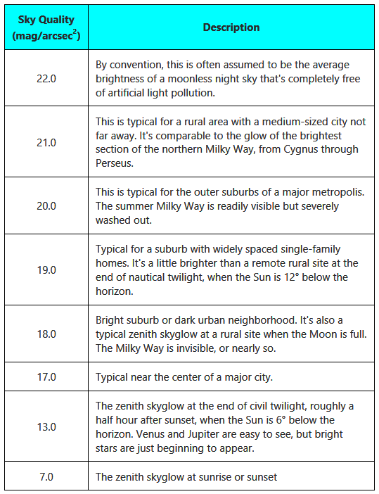

# ASCOM ObservingConditions Interface

> This documentation is sourced from the official [ASCOM ObservingConditions Interface](https://ascom-standards.org/newdocs/observingconditions.html) documentation.

**See Also:** [ASCOM Exceptions](ascom-exceptions.md) | [Common Types](ascom-common-types.md)

## Methods

### Action()

**Description:** Invoke the specified device-specific custom action.

**Parameters:**
- `ActionName` (`str`) - A name from `SupportedActions` that represents the action to be carried out.
- `ActionParameters` (`str`) - List of required arguments or empty string if none are required.

**Returns:** `str` - Action response. The meaning of returned strings is set by the driver author.

**Exceptions:**
- `MethodNotImplementedException` - If no actions at all are supported.
- `ActionNotImplementedException` - If the driver does not support the requested ActionName.
- `NotConnectedException` - If the device is not connected.
- `DriverException` - An error occurred that is not described by one of the more specific ASCOM exceptions.

---

### CommandBlind()

**Description:** Transmit an arbitrary string to the device and does not wait for a response.

> **Deprecated** - Use the more flexible `Action()` and `SupportedActions` mechanic.

**Parameters:**
- `Command` (`str`) - The literal command string to be transmitted.
- `Raw` (`bool`) - If True, command is transmitted 'as-is'. If False, then protocol framing characters may be added prior to transmission.

**Returns:** Nothing

**Exceptions:**
- `MethodNotImplementedException` - If the method is not implemented.
- `NotConnectedException` - If the device is not connected.
- `DriverException` - An error occurred that is not described by one of the more specific ASCOM exceptions.

---

### CommandBool()

**Description:** Transmit an arbitrary string to the device and wait for a boolean response.

> **Deprecated** - Use the more flexible `Action()` and `SupportedActions` mechanic.

**Parameters:**
- `Command` (`str`) - The literal command string to be transmitted.
- `Raw` (`bool`) - If True, command is transmitted 'as-is'. If False, then protocol framing characters may be added prior to transmission.

**Returns:** `bool` - True/False response from the command.

**Exceptions:**
- `MethodNotImplementedException` - If the method is not implemented.
- `NotConnectedException` - If the device is not connected.
- `DriverException` - An error occurred that is not described by one of the more specific ASCOM exceptions.

---

### CommandString()

**Description:** Transmit an arbitrary string to the device and wait for a string response.

> **Deprecated** - Use the more flexible `Action()` and `SupportedActions` mechanic.

**Parameters:**
- `Command` (`str`) - The literal command string to be transmitted.
- `Raw` (`bool`) - If True, command is transmitted 'as-is'. If False, then protocol framing characters may be added prior to transmission.

**Returns:** `str` - String response from the command.

**Exceptions:**
- `MethodNotImplementedException` - If the method is not implemented.
- `NotConnectedException` - If the device is not connected.
- `DriverException` - An error occurred that is not described by one of the more specific ASCOM exceptions.

---

### Connect()

**Description:** Connect to the device asynchronously. Use this to connect to a device rather than setting `Connected` to True.

> Added in version 2: Preferred asynchronous connection mechanic.

**Parameters:** None

**Returns:** Nothing

**Exceptions:**
- `DriverException` - An error occurred that is not described by one of the more specific ASCOM exceptions.

**Notes:**
- **Non-Blocking**. On return, `Connecting` must be True unless already connected. Connection has successfully completed when `Connecting` becomes (or is) False.
- This is a mandatory method and must not throw a `MethodNotImplementedException`.

---

### Disconnect()

**Description:** Disconnect from the device asynchronously. Use this to disconnect from a device rather than setting `Connected` to False.

> Added in version 2: Preferred asynchronous connection mechanic.

**Parameters:** None

**Returns:** Nothing

**Exceptions:**
- `DriverException` - An error occurred that is not described by one of the more specific ASCOM exceptions.

**Notes:**
- **Non-Blocking**. On return, `Connecting` must be True unless already disconnected. Disconnect has successfully completed when `Connecting` becomes (or is) False.
- This is a mandatory method and must not throw a `MethodNotImplementedException`.

---

### Refresh()

**Description:** Forces the device to immediately query its attached hardware to refresh sensor values.

**Parameters:** None

**Returns:** Nothing

**Exceptions:**
- `MethodNotImplementedException` - If refreshing is not supported.
- `NotConnectedException` - If the device is not connected.
- `DriverException` - An error occurred that is not described by one of the more specific ASCOM exceptions.

**Notes:**
- This must be a short-lived synchronous call that triggers a refresh. It must not wait for long running processes to complete. It is the client's responsibility to poll `TimeSinceLastUpdate` to determine whether/when the data has been refreshed.

---

### SensorDescription()

**Description:** Returns a description of the sensor providing the requested property.

**Parameters:**
- `PropertyName` (`str`) - The caseless name of the ObservingConditions meteorological property for which the sensor description is desired. For example "WindSpeed" shall return a description of the sensor used to measure the wind speed.

**Returns:** `str` - Description of the sensor used to measure the specified property.

**Exceptions:**
- `MethodNotImplementedException` - If the requested property/sensor is not implemented at all.
- `InvalidValueException` - If `PropertyName` is not the name of one of the properties of ObservingConditions.
- `NotConnectedException` - If the device is not connected, and a connection is needed to get the descriptive name.
- `DriverException` - An error occurred that is not described by one of the more specific ASCOM exceptions.

**Notes:**
- Must **not** throw a `MethodNotImplementedException` when the specified sensor is implemented but not returning data.
- **Must** throw a `MethodNotImplementedException` when the specified sensor is not implemented at all.
- If the sensor is implemented, this must return a valid string, even if the driver is not connected, so that applications can use this to determine what sensors are available.

---

### SetupDialog()

**Description:** Launches a configuration dialogue box for the driver. The call will not return until the user clicks OK or cancels manually.

**Parameters:** None

**Returns:** Nothing

**Exceptions:**
- `DriverException` - An error occurred that is not described by one of the more specific ASCOM exceptions.

**Notes:**
- Must be implemented, must not throw a `PropertyNotImplementedException`.
- **Blocking** - It is permissible that the configuration dialog is modal, and for the driver not to respond to other calls while this dialog is open.
- This method is only valid for COM drivers. Alpaca devices should provide configuration through the Alpaca HTML endpoints.

---

### TimeSinceLastUpdate()

**Description:** Returns the elapsed time (seconds) since the last update of the sensor providing the requested property.

**Parameters:**
- `PropertyName` (`str`) - The name (in any casing) of the ObservingConditions meteorological property for which time since last update is desired. For example "WindSpeed" shall return the number of seconds since wind speed was last updated.

**Returns:** `float` - Elapsed time (seconds) since the requested property was last updated.

**Exceptions:**
- `MethodNotImplementedException` - If the requested property/sensor is not implemented.
- `InvalidValueException` - If `PropertyName` is not the name of one of the properties of ObservingConditions.
- `NotConnectedException` - If the device is not connected.
- `DriverException` - An error occurred that is not described by one of the more specific ASCOM exceptions.

**Notes:**
- Must **not** throw a `MethodNotImplementedException` when the specified sensor is implemented but **must** throw a `MethodNotImplementedException` when the specified sensor is not implemented.
- Return a negative value to indicate that no valid value has ever been received from the hardware.
- If an empty string is supplied as the `PropertyName`, the driver must return the time since the most recent update of any sensor. A `MethodNotImplementedException` must **not** be thrown.

---

## Properties

### AveragePeriod

**Type:** `float` (Read/Write)

**Description:** Gets and sets the time period (hours) over which observations will be averaged.

**Exceptions:**
- `InvalidValueException` - If the value set is not available for this driver. All drivers must accept 0.0 to specify that an instantaneous value is available.
- `NotConnectedException` - If the device is not connected.
- `DriverException` - An error occurred that is not described by one of the more specific ASCOM exceptions.

**Notes:**
- Mandatory property, must be implemented, can not throw a `PropertyNotImplementedException`.
- If the device is delivering instantaneous sensor readings this property must return a value of 0.0.

---

### CloudCover

**Type:** `float` (Read-Only)

**Description:** Amount of sky obscured by cloud in percent (0.0 - 100.0).

**Exceptions:**
- `PropertyNotImplementedException` - The device does not implement this property.
- `NotConnectedException` - If the device is not connected.
- `DriverException` - An error occurred that is not described by one of the more specific ASCOM exceptions.

**Notes:**
- Optional property, can throw a `PropertyNotImplementedException`.
- Returns a value between 0.0 (clear sky) and 100.0 (100% cloud coverage).

---

### Connected

**Type:** `bool` (Read/Write)

**Description:** Retrieve or set the connected state of the device.

> Writing to change connection state superseded by asynchronous `Connect()`, `Disconnect()`, and `Connecting` in version 2.

**Exceptions:**
- `DriverException` - An error occurred that is not described by one of the more specific ASCOM exceptions.

**Notes:**
- Must be implemented, must not throw a `PropertyNotImplementedException`.
- Do not use a `NotConnectedException` here, that exception is for use in other methods that require a connection in order to succeed.
- Multiple calls setting Connected to True or False will not cause an error.

---

### Connecting

**Type:** `bool` (Read-Only)

**Description:** Returns True while the device is undertaking an asynchronous connect or disconnect operation.

> Added in version 2: Preferred asynchronous connection mechanic.

**Exceptions:**
- `DriverException` - An error occurred that is not described by one of the more specific ASCOM exceptions.

**Notes:**
- Must be implemented, must not throw a `PropertyNotImplementedException`.
- This is the correct property for determining when the non-blocking methods `Connect()` or `Disconnect()` have completed. Completion is when `Connecting` becomes False after calling either of these methods.

---

### Description

**Type:** `str` (Read-Only)

**Description:** Description of the device such as manufacturer and model number. Any ASCII characters may be used.

**Exceptions:**
- `NotConnectedException` - If the device is not connected.
- `DriverException` - An error occurred that is not described by one of the more specific ASCOM exceptions.

**Notes:**
- Must be implemented, must not throw a `PropertyNotImplementedException`.
- This describes the device, not the driver. See the `DriverInfo` property for information on the ASCOM driver.
- The description length must be a maximum of 64 characters so that it can be used in FITS image headers.

---

### DeviceState

**Type:** `List[StateValue]` (Read-Only)

**Description:** Returns a list of `StateValue` objects representing the operational properties of this device.

> Added in version 2: To allow reduction of status polling.

**Notes:**
This device must return the following operational properties if they are known:
- CloudCover
- DewPoint
- Humidity
- Pressure
- RainRate
- SkyBrightness
- SkyQuality
- SkyTemperature
- StarFWHM
- Temperature
- WindDirection
- WindGust
- WindSpeed
- TimeStamp

---

### DewPoint

**Type:** `float` (Read-Only)

**Description:** Atmospheric dew point temperature (degrees Celsius) at the observatory.

**Exceptions:**
- `PropertyNotImplementedException` - The device does not implement this property.
- `NotConnectedException` - If the device is not connected.
- `DriverException` - An error occurred that is not described by one of the more specific ASCOM exceptions.

**Notes:**
- Optional property when `Humidity` also throws `PropertyNotImplementedException`.
- Mandatory property when `Humidity` is implemented.
- The ASCOM specification requires that DewPoint and Humidity are either both implemented or both throw `PropertyNotImplementedException`.

---

### DriverInfo

**Type:** `str` (Read-Only)

**Description:** Descriptive and version information about the ASCOM driver.

**Exceptions:**
- `DriverException` - An error occurred that is not described by one of the more specific ASCOM exceptions.

**Notes:**
- Must be implemented, must not throw a `PropertyNotImplementedException`.
- This string may contain line endings and may be hundreds to thousands of characters long.

---

### DriverVersion

**Type:** `str` (Read-Only)

**Description:** String containing only the major and minor version of the driver.

**Exceptions:**
- `DriverException` - An error occurred that is not described by one of the more specific ASCOM exceptions.

**Notes:**
- Must be implemented, must not throw a `PropertyNotImplementedException`.
- This must be in the form "n.n".

---

### Humidity

**Type:** `float` (Read-Only)

**Description:** Atmospheric relative humidity (0.0 - 100.0 percent) at the observatory.

**Exceptions:**
- `PropertyNotImplementedException` - The device does not implement this property.
- `NotConnectedException` - If the device is not connected.
- `DriverException` - An error occurred that is not described by one of the more specific ASCOM exceptions.

**Notes:**
- Optional property when `DewPoint` also throws `PropertyNotImplementedException`.
- Mandatory property when `DewPoint` is implemented.
- The ASCOM specification requires that DewPoint and Humidity are either both implemented or both throw `PropertyNotImplementedException`.

---

### InterfaceVersion

**Type:** `int` (Read-Only)

**Description:** ASCOM Device interface definition version that this device supports. Should return 2 for this interface version.

**Exceptions:**
- `DriverException` - An error occurred that is not described by one of the more specific ASCOM exceptions.

**Notes:**
- Must be implemented, must not throw a `PropertyNotImplementedException`.
- This is a single "short" integer indicating the version of this specific ASCOM universal interface definition.

---

### Name

**Type:** `str` (Read-Only)

**Description:** The short name of the driver, for display purposes.

**Exceptions:**
- `DriverException` - An error occurred that is not described by one of the more specific ASCOM exceptions.

**Notes:**
- Must be implemented, must not throw a `PropertyNotImplementedException`.
- The `Description` property is used to return info about the device rather than the driver.

---

### Pressure

**Type:** `float` (Read-Only)

**Description:** Atmospheric pressure (hPa) at the observatory altitude.

**Exceptions:**
- `PropertyNotImplementedException` - The device does not implement this property.
- `NotConnectedException` - If the device is not connected.
- `DriverException` - An error occurred that is not described by one of the more specific ASCOM exceptions.

**Notes:**
- This must be the pressure at the observatory altitude and not the adjusted pressure at sea level.
- If your pressure sensor returns sea level pressure, your device must convert this to actual pressure at the observatory's altitude before returning a value to the client.

---

### RainRate

**Type:** `float` (Read-Only)

**Description:** Rain rate (mm/hr) at the observatory.

**Exceptions:**
- `PropertyNotImplementedException` - The device does not implement this property.
- `NotConnectedException` - If the device is not connected.
- `DriverException` - An error occurred that is not described by one of the more specific ASCOM exceptions.

**Notes:**
- The units of this property are millimetres per hour.
- This property can be interpreted as 0.0 = Dry, any positive nonzero value = wet.
- Rainfall intensity classification:
  - Light rain: less than 2.5 mm per hour
  - Moderate rain: between 2.5 mm and 10 mm per hour
  - Heavy rain: between 10 mm and 50 mm per hour
  - Violent rain: greater than 50 mm per hour

---

### SkyBrightness

**Type:** `float` (Read-Only)

**Description:** Sky brightness (Lux) at the observatory.

**Exceptions:**
- `PropertyNotImplementedException` - The device does not implement this property.
- `NotConnectedException` - If the device is not connected.
- `DriverException` - An error occurred that is not described by one of the more specific ASCOM exceptions.

**Notes:**
Typical sky brightness values:
- 0.0001 lux - Moonless, overcast night sky (starlight)
- 0.002 lux - Moonless clear night sky with airglow
- 0.27-1.0 lux - Full moon on a clear night
- 3.4 lux - Dark limit of civil twilight under a clear sky
- 100 lux - Very dark overcast day
- 400 lux - Sunrise or sunset on a clear day
- 1000 lux - Overcast day
- 10000-25000 lux - Full daylight (not direct sun)
- 32000-100000 lux - Direct sunlight

#### Sky Quality Reference

---

### SkyQuality

**Type:** `float` (Read-Only)

**Description:** Sky quality (magnitudes per square arcsecond) at the observatory.

**Exceptions:**
- `PropertyNotImplementedException` - The device does not implement this property.
- `NotConnectedException` - If the device is not connected.
- `DriverException` - An error occurred that is not described by one of the more specific ASCOM exceptions.

---

### SkyTemperature

**Type:** `float` (Read-Only)

**Description:** Sky temperature (degrees Celsius) at the observatory.

**Exceptions:**
- `PropertyNotImplementedException` - The device does not implement this property.
- `NotConnectedException` - If the device is not connected.
- `DriverException` - An error occurred that is not described by one of the more specific ASCOM exceptions.

**Notes:**
- This is expected to be returned by an infra-red sensor looking at the sky.
- The lower the temperature the more the sky is likely to be clear.

---

### StarFWHM

**Type:** `float` (Read-Only)

**Description:** Seeing (FWHM in arc-seconds) at the observatory.

**Exceptions:**
- `ValueNotSetException` - Seeing data not currently available (daylight, clouds etc.).
- `PropertyNotImplementedException` - The device does not implement this property.
- `NotConnectedException` - If the device is not connected.
- `DriverException` - An error occurred that is not described by one of the more specific ASCOM exceptions.

---

### SupportedActions

**Type:** `List[str]` (Read-Only)

**Description:** Returns the list of custom action names supported by this driver, to be used with `Action()`.

**Exceptions:**
- `DriverException` - An error occurred that is not described by one of the more specific ASCOM exceptions.

**Notes:**
- Must be implemented, must not throw a `PropertyNotImplementedException`.
- SupportedActions is a "discovery" mechanism that enables clients to know which Actions a device supports without having to exercise the Actions themselves.

---

### Temperature

**Type:** `float` (Read-Only)

**Description:** Atmospheric temperature (degrees Celsius) at the observatory.

**Exceptions:**
- `PropertyNotImplementedException` - The device does not implement this property.
- `NotConnectedException` - If the device is not connected.
- `DriverException` - An error occurred that is not described by one of the more specific ASCOM exceptions.

---

### WindDirection

**Type:** `float` (Read-Only)

**Description:** Direction (degrees) from which the wind is blowing at the observatory.

**Exceptions:**
- `PropertyNotImplementedException` - The device does not implement this property.
- `NotConnectedException` - If the device is not connected.
- `DriverException` - An error occurred that is not described by one of the more specific ASCOM exceptions.

**Notes:**
- **Meteorological standards:** Wind direction is that from which the wind is blowing, measured in degrees clockwise from True North.
  - North = 0.0
  - East = 90.0
  - South = 180.0
  - West = 270.0
- If the wind velocity is 0 then direction must be reported as 0.

---

### WindGust

**Type:** `float` (Read-Only)

**Description:** Peak 3 second wind gust (m/s) at the observatory over the last 2 minutes.

**Exceptions:**
- `PropertyNotImplementedException` - The device does not implement this property.
- `NotConnectedException` - If the device is not connected.
- `DriverException` - An error occurred that is not described by one of the more specific ASCOM exceptions.

---

### WindSpeed

**Type:** `float` (Read-Only)

**Description:** Wind speed (m/s) at the observatory.

**Exceptions:**
- `PropertyNotImplementedException` - The device does not implement this property.
- `NotConnectedException` - If the device is not connected.
- `DriverException` - An error occurred that is not described by one of the more specific ASCOM exceptions.
